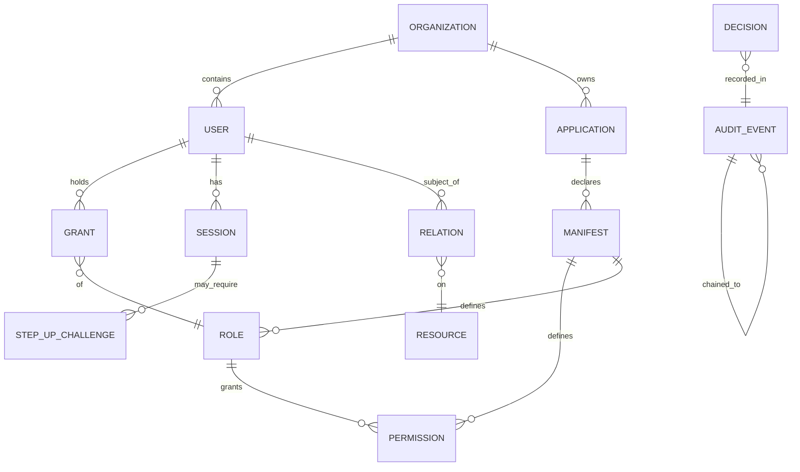

# Data model

All tables are prefixed `iam_` and created by the package migrations (loaded automatically; toggle with
`iam.run_migrations`). This page groups them by domain. The migration files are the source of truth in
`database/migrations/`.

## Tables by domain

| Domain | Tables (migration) | Holds |
|---|---|---|
| **Identity & tenancy** | `iam_core_tables`, `iam_sessions`, `iam_step_up_challenges`, `iam_federated_identities` | users, organizations, server-side sessions, step-up challenges, federation links |
| **Authorization catalog** | `iam_authz_catalog`, `add_relation_to_iam_permissions` | permissions, roles, grants; the optional `relation` binding on permissions |
| **ReBAC** | `iam_relations`, `iam_groups_tables` | `(subject, relation, object)` tuples; groups and membership (write the `member` tuple) |
| **Crypto / keys** | `iam_data_keys`, `iam_signing_keys` | envelope-encryption data keys; ES256 signing keys (rotating) |
| **OAuth / OIDC** | `iam_oauth_clients`, `iam_oauth_grant_tables`, `add_session_to_oauth_auth_codes` | clients; auth codes, access/refresh tokens, scopes; `sid` link on auth codes |
| **Applications** | `iam_applications_and_manifests` | the Application Registry and submitted/applied manifests |
| **Audit** | `iam_audit_tables` | hash-chained events, checkpoints, outbox/webhook deliveries, PII envelopes |
| **Governance** | `iam_review_tables`, `iam_access_requests`, `iam_approval_steps` | review campaigns + items; access requests; approver-chain steps |
| **Infra** | `iam_idempotency_keys`, `iam_directory_sources` | idempotency keys for writes; directory source config |

## How the core entities relate

This is a conceptual view — the physical schema lives in the migrations; consult them for exact columns,
indexes and foreign keys.

## Notable design choices

::: card "Hash-chained audit" icon:link
`iam_audit_tables` stores the per-event hash and the link to the prior event, plus checkpoints and the
outbox. See [Tamper-evident audit](/concepts/tamper-evident-audit).
:::

::: card "Idempotency keys" icon:repeat
`iam_idempotency_keys` dedupes write operations carrying an `Idempotency-Key`, so retries don't double-apply
a manifest or double-grant access.
:::

::: card "Relations as tuples" icon:share-2
`iam_relations` stores ReBAC edges; `iam_groups_tables` membership writes the `member` tuple so nesting is
visible to the resolver. See [ReBAC relationships](/guides/rebac-relationships).
:::

::: card "Encrypted secrets" icon:lock
Client secrets, refresh tokens and PII are encrypted via the crypto layer (`iam_data_keys` holds the
envelope-encryption data keys). Secrets are write-only across the Admin API.
:::

::: callout warning "Don't write these tables directly" icon:database
No UI or integration should `INSERT`/`UPDATE` IAM tables out of band — that bypasses validation, idempotency
and the audit chain (and can break tamper-evidence). Go through the Admin API or the domain services.
:::

## Next

- [Tamper-evident audit](/concepts/tamper-evident-audit) — the audit tables' guarantees.
- [Database schema reference](/reference/database-schema) — the migration list in detail.
- [Architecture overview](/architecture/overview) — the domains these tables back.
