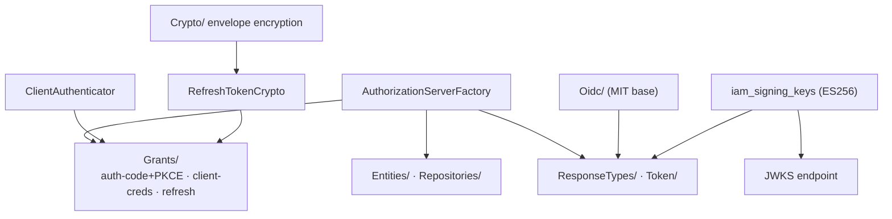
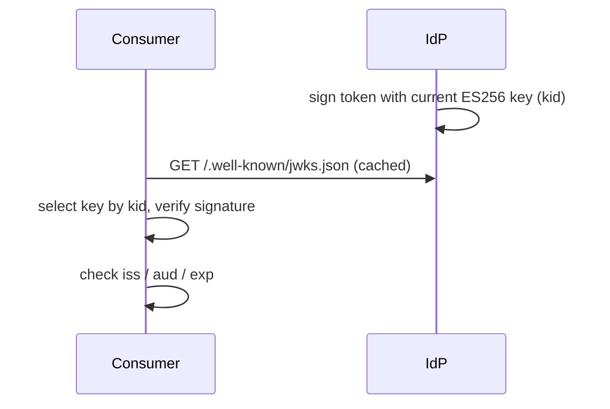

# OAuth2 & OIDC architecture

The server is a full identity provider built on
[`league/oauth2-server`](https://oauth2.thephpleague.com/) — **not** Passport — with an OpenID Connect layer
on top. Code lives in `src/Domain/OAuth/`.

## Components

| Piece | Role |
|---|---|
| `AuthorizationServerFactory` | Wires the league authorization server with the configured grants. |
| `Grants/` | authorization-code (+ PKCE), client-credentials, refresh-token. |
| `Entities/`, `Repositories/` | league entity + repository implementations backed by the IAM tables. |
| `Token/`, `ResponseTypes/` | Token issuance, JWKS exposure, introspection plumbing. |
| `ClientAuthenticator` | Authenticates confidential clients. |
| `RefreshTokenCrypto` | Encrypts refresh tokens at rest; rotation on use. |
| `Oidc/` | id_token issuance, discovery, JWKS — on an **MIT** base. |

## Signing: ES256 + JWKS

Access tokens and id_tokens are signed with **ES256** (ECDSA P-256) using rotating keys in
`iam_signing_keys`. The public keys are published at the JWKS endpoint so any consumer verifies signatures
**offline** — the common path needs no introspection round-trip.

Key rotation publishes the new public key in JWKS before signing with it, so in-flight tokens keep
verifying.

## Encrypted, rotating refresh tokens

Refresh tokens are encrypted at rest via `RefreshTokenCrypto` (over the [crypto
layer](/operations/configuration#crypto--keys)) and **rotated on use**: redeeming a refresh token issues a
new pair and invalidates the old refresh token. A stolen-and-reused old token is detectable.

## Sessions bind to tokens

Tokens carry a `sid` linking them to a server-side, revocable [session](/guides/sessions-and-step-up). This
is what lets an admin revoke access immediately despite a still-unexpired JWT.

## The OIDC layer

`Oidc/` adds the identity protocol: the `/.well-known/openid-configuration` discovery document, JWKS, and
signed `id_token`s with standard claims plus the authentication AAL. Federated identities link upstream
providers (`iam_federated_identities`).

::: callout danger "Licensing invariant — MIT only" icon:scale
The OIDC layer uses the **MIT** steverhoades base. **AGPL** code (limosa-io) is forbidden in this codebase,
and OAuth must remain `league/oauth2-server`. This is a hard ecosystem rule, enforced in review — never
introduce an AGPL OAuth/OIDC dependency.
:::

::: collapsible "ADR — league/oauth2-server + a thin MIT OIDC layer"
**Problem.** Passport is opinionated and tied to a session model; many OIDC libraries are AGPL.

**Decision.** Build directly on `league/oauth2-server` (MIT) and add a thin MIT OIDC layer. Keep tokens as
verifiable ES256 JWTs with JWKS, bound to revocable sessions.

**Consequences.** A permissively-licensed, self-contained IdP with offline verification and immediate
revocation. The cost is implementing the grant wiring ourselves instead of adopting a turnkey package — which
is what keeps the licensing clean.
:::

## Next

- [OAuth2 clients & PKCE](/guides/oauth-clients) — the grant flows in practice.
- [OIDC login](/guides/oidc-login) — the identity layer for consuming apps.
- [Configuration](/operations/configuration#oauth) — grants, TTLs, PKCE, encryption key.
