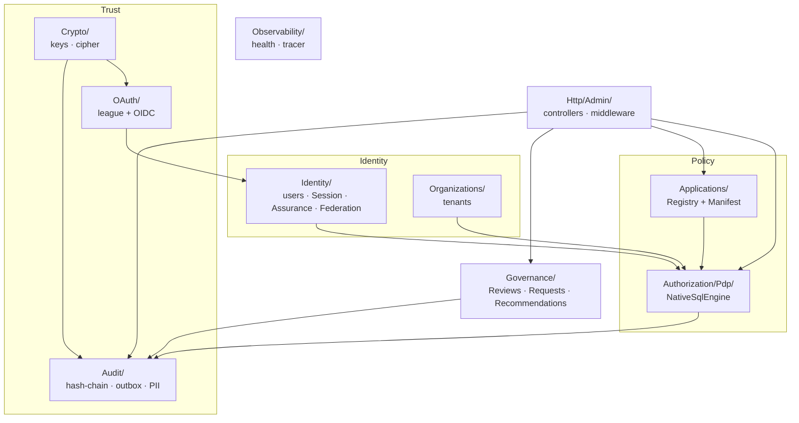
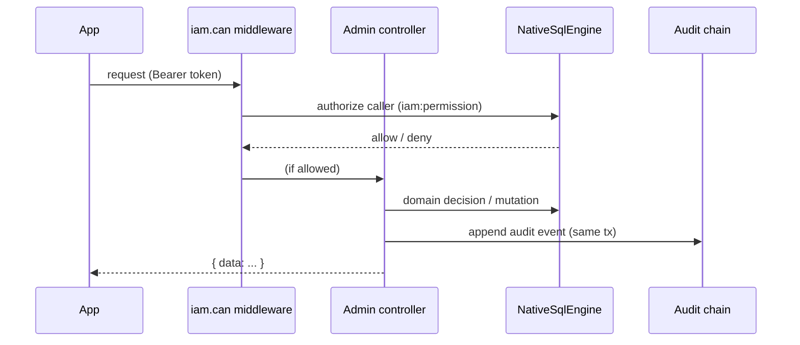

# Architecture overview

Everything lives under the `Padosoft\Iam\` namespace in `src/`, organized by domain. This page is the map;
each subsystem has its own deep page.

## The domains

## Subsystem map

| Namespace | Responsibility | Deep page |
|---|---|---|
| `Domain/Identity/` | Users, server-side `Session/`, `Assurance/` (AAL), `Federation/`, `Models/` | [Sessions & step-up](/guides/sessions-and-step-up) |
| `Domain/Organizations/` | Tenant/org isolation | [Multi-tenancy](/concepts/multi-tenancy) |
| `Domain/Applications/` | Application Registry + `Manifest/` (validate, diff, apply, registry) | [Manifests](/concepts/manifests) |
| `Domain/Authorization/Pdp/` | The PDP — `NativeSqlEngine`, `ConditionEvaluator`, `DecisionQuery`, `Decision` | [PDP pipeline](/architecture/pdp-pipeline) |
| `Domain/Crypto/` | `LocalKeyProvider` (envelope encryption), `LocalSecretCipher` (encrypt/decrypt/shred) | [Configuration](/operations/configuration#crypto--keys) |
| `Domain/OAuth/` | IdP on `league/oauth2-server` + `Oidc/` (MIT) | [OAuth & OIDC](/architecture/oauth-oidc) |
| `Domain/Audit/` | Hash-chain, `Export/`, `Webhooks/`, `Outbox/`, `Pii/`, `Events/` | [Tamper-evident audit](/concepts/tamper-evident-audit) |
| `Domain/Governance/` | `Reviews/`, `Requests/`, `Recommendations/`, `NativeFeatureScope` | [Access reviews](/guides/access-reviews) |
| `Http/Admin/` | Controllers + `Middleware/` (`iam.admin_auth`/`iam.can`/`iam.idempotency`) | [Admin API](/reference/admin-api) |
| `Observability/` | `HealthCheck`, `Tracer`/`NullTracer`/`LogTracer` | [Observability](/operations/observability) |

## Implementing the contracts

The server is the reference implementation of
[`laravel-iam-contracts`](https://doc.laravel-iam-contracts.padosoft.com):

| Contract | Server implementation |
|---|---|
| `AuthorizationEngine` | `NativeSqlEngine` |
| `KeyProvider` | `LocalKeyProvider` |
| `SecretCipher` | `LocalSecretCipher` |
| `FeatureScope` | `NativeFeatureScope` |

Consumers depend on the contracts, not on the server internals — which is what lets the
[clients and SDKs](https://doc.laravel-iam-client.padosoft.com) talk to it over a stable interface.

## A request, end to end

Note the PDP appears **twice**: once to authorize the admin caller (via `iam.can`), and once for the domain
operation. The Admin API authorizes itself with the same engine it exposes.

## Next

- [PDP decision pipeline](/architecture/pdp-pipeline) — the engine in detail.
- [Data model](/architecture/data-model) — the tables behind these domains.
- [Architecture decisions](/architecture/decisions) — the reasoning, as ADRs.
