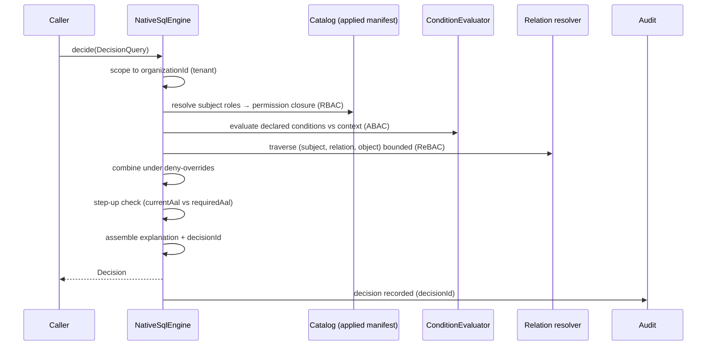

# PDP decision pipeline

This page traces a single decision from `DecisionQuery` to `Decision`, so you know exactly where each
behavior lives. The engine is `NativeSqlEngine` in `src/Domain/Authorization/Pdp/`.

## The full lifecycle



## Stage 1 — intake & tenant scope

The query is bound to `organizationId`. From here every lookup is filtered to that tenant — a cross-tenant
subject or resource is simply not in scope. Malformed input (unknown permission shape, bad subject ref) is a
**fail-closed deny** here, not an exception.

## Stage 2 — RBAC role closure

The engine resolves the subject's roles (direct + inherited) into a permission set — the closure
$R^{*}(s)$ from [Authorization models](/concepts/authorization-models). If the requested permission slug is
in the closure, RBAC contributes a permit candidate.

## Stage 3 — ABAC conditions

For a permission carrying a declared `condition`, `ConditionEvaluator` checks it against the query
`context`. A failing condition withholds the permit and is recorded in `Decision::$failedConditions`. Only
declarative comparisons are supported — there is no arbitrary code execution in a condition.

## Stage 4 — ReBAC traversal

If the query carries a `relation` + `resourceRef`, or the permission binds a relation, the relation resolver
walks the graph in `iam_relations` — direct, group nesting, resource hierarchy (`parent`), relation
implication — **bounded** by a depth + cycle guard. Exceeding the bound is a deny surfaced in the
explanation. Full detail in [ReBAC relationships](/guides/rebac-relationships).

## Stage 5 — combine under deny-overrides

The three models' verdicts combine with **deny-overrides**: any explicit deny wins; otherwise any permit
allows; otherwise default-deny. This is monotone in deny — see
[Deny-overrides & fail-closed](/concepts/deny-overrides-fail-closed).

## Stage 6 — step-up

If the granting policy requires a higher AAL than `currentAal`, the engine returns `allowed = false` with
`requiresStepUp = true` and `requiredAal`. The grant exists; the *proof* is insufficient. See
[Assurance levels](/concepts/assurance-aal).

## Stage 7 — explanation, decisionId, audit

The engine assembles a `Decision`:

- `decisionId` — a stable id to cite in your audit log.
- `policyVersion` — which applied-manifest version decided.
- `matched` — the `{type, key}` policies that fired.
- `failedConditions` — ABAC conditions that did not hold.
- `explanation` — human-readable, populated when `explain: true`.

The decision is recorded into the [hash-chained audit](/concepts/tamper-evident-audit) so the answer is
later provable.

## Two entrypoints, one pipeline

```php
public function decide(DecisionQuery $q): Decision;          // native, typed
public function check(array $query): array;                  // AuthorizationEngine contract (wire/SDK)
public function listSubjects(string $relation, string $objectType, string $objectId): iterable;
public function listResources(SubjectRef $subject, string $relation): iterable;
```

`decide` and `check` run the same evaluation; `listSubjects`/`listResources` answer the ReBAC reverse-index
("who can access R?" / "what can S access?").

::: callout warning "Every stage fails closed" icon:shield
Each stage either contributes a verdict or, on error/missing data, contributes nothing and lets default-deny
stand — never an allow. There is no stage whose failure widens access.
:::

## Next

- [Authorization models](/concepts/authorization-models) — the formal definitions behind the stages.
- [Decision contract](/reference/decision-contract) — every field of the result.
- [Architecture decisions](/architecture/decisions) — why the pipeline is shaped this way.
