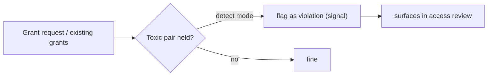

# Least-privilege & SoD

Granting access is easy; keeping it *minimal and conflict-free* is the hard part governance solves.
Two mechanisms help: **least-privilege recommendations** and **separation-of-duties (SoD)**. Both live in
`src/Domain/Governance/` and are configured in `config/iam-governance.php`.

## Least-privilege: revoke what isn't used

`GrantUsageRecorder` records when grants are actually exercised; `Recommendations/` turns that into
candidates for revocation using deterministic thresholds (`iam-governance.php` → `least_privilege`):

| Threshold | Default | Meaning |
|---|---|---|
| `unused_days` | 90 | a grant not used in N days → candidate to revoke |
| `dormant_days` | 90 | an account without login in N days → dormant |
| `wide_role_permissions` | 50 | a role with more than N permissions → too broad |

```bash
curl https://iam.example.com/api/iam/v1/recommendations/least-privilege -H "Authorization: Bearer $ADMIN_TOKEN"
# or offline
php artisan iam:least-privilege:scan --org=org_123
```

These recommendations also surface as **risk signals** inside [access reviews](/guides/access-reviews), so a
reviewer sees "held but never used" next to each item.

::: callout tip "Deterministic, not magic" icon:gauge
The recommender is a deterministic rules engine over usage data — no model, no guessing. The same inputs
always produce the same recommendations, which is what makes them defensible in an audit.
:::

## Separation of Duties: forbid toxic combinations

Some permission pairs must never be held by the same subject — *create vendor* + *approve payment*, for
example. Declare these as **toxic combinations** (`iam-governance.php` → `toxic_combinations`):

```php
'toxic_combinations' => [
    ['finance:vendor.create', 'finance:payment.approve'],
],
```

SoD defaults to `detect` (`features.sod` → `default: 'detect'`) — it **observes and flags** rather than
blocking, so you find existing violations before you enforce. Promote to enforcement deliberately once your
catalog is clean.



## Feature gating

Both features are gated per layer / app / role / user via `NativeFeatureScope`:

| Feature | Default | Permission |
|---|---|---|
| `least_privilege` | `on` | `iam:least_privilege.view` |
| `sod` | `detect` | — |
| `anomaly_detection` | `on` | `iam:anomaly.view` |

## A least-privilege workflow

::: steps
1. **Record usage** — `GrantUsageRecorder` runs as access happens.
2. **Scan** — `iam:least-privilege:scan` (schedule it) produces recommendations.
3. **Review** — run an [access review](/guides/access-reviews); recommendations appear as signals.
4. **Revoke** — certify what's needed, revoke what isn't. Every action is audited.
5. **Detect conflicts** — SoD flags toxic pairs continuously; resolve before enforcing.
:::

::: callout warning "Snapshot semantics" icon:camera
Recommendations and SoD signals attached to a review are **frozen** when the campaign opens — a later
catalog change doesn't rewrite a campaign's evidence. Re-run the scan for fresh numbers.
:::

## Next

- [Access reviews](/guides/access-reviews) — where these signals are acted on.
- [Audit & compliance](/best-practices/audit-and-compliance) — proving least-privilege to an auditor.
- [Configuration](/operations/configuration#governance) — thresholds and feature gates.
