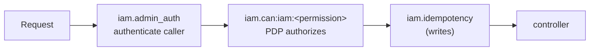
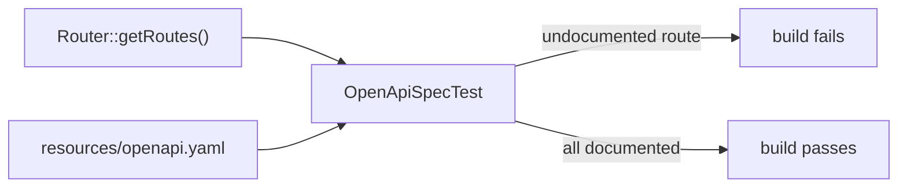

# Securing the Admin API

The Admin API at `/api/iam/v1` is the only write path into the server — so it is the surface that must be
hardened. The good news: most of the hardening is built in and on by default.

## Two middleware on every route



- **`iam.admin_auth`** (`AdminAuthenticate`) authenticates the admin caller via bearer token.
- **`iam.can:iam:<permission>`** (`AuthorizeIamPermission`) authorizes through the **PDP** — e.g.
  `iam.can:iam:manifests.apply`. The Admin API authorizes itself with the same engine it exposes.

::: callout warning "Always send the token as a bearer header" icon:key-round
Pass the admin token in `Authorization: Bearer …` — never in a query string or a plain form field, where it
lands in logs and history.
:::

## Pin the token audience

Set `iam.admin.audience` (`IAM_ADMIN_AUDIENCE`) in production: a token whose `aud` doesn't match is rejected
**fail-closed**. Leaving it empty (dev) accepts any valid IAM token — don't ship that.

## Idempotency on writes

Write routes accept an `Idempotency-Key`; retries don't double-apply:

```bash
curl -X POST https://iam.example.com/api/iam/v1/manifests/{id}/apply \
  -H "Authorization: Bearer $ADMIN_TOKEN" \
  -H "Idempotency-Key: $(uuidgen)"
```

Keys are stored in `iam_idempotency_keys`. Always send one for non-GET operations from automation.

## Secrets are write-only

Webhook secrets, federated-provider `client_secret`, and directory-source `bind_secret` are **write-only** —
stored encrypted, never returned by the API. Rotate rather than read back; a leaked API response must not
leak signing material.

## Rate limiting

The Admin API is rate-limited per client + IP (`iam.admin.rate_limit`, default 120/min); OAuth endpoints
have their own limit (`iam.oauth.rate_limit`, default 60/min). Tune for your automation, but keep a ceiling.

## Tenant scope is a release blocker

Every read is tenant-scoped; cross-tenant access returns **404**. If you extend the API, preserve this —
"could this return another org's data?" is a top-severity question. See
[Multi-tenancy](/concepts/multi-tenancy).

## The contract can't drift



`OpenApiSpecTest` compares Laravel's registered admin routes against `resources/openapi.yaml` and **fails
the build** if any route is undocumented. Adding a route means updating the spec — so the published contract
is always accurate.

::: callout tip "The panel is just a client" icon:shield
The React admin panel performs **no** privileged DB access — it goes through this same hardened API. There is
no back door that skips `iam.can`, idempotency or audit. Your automation and the UI are equally governed.
:::

## Next

- [Admin API reference](/reference/admin-api) — the full route surface.
- [Multi-tenancy](/concepts/multi-tenancy) — the 404-not-403 invariant.
- [Fail-closed design](/best-practices/fail-closed-design) — fail-closed at the edge.
