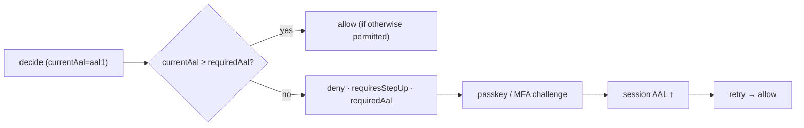

# Assurance levels (AAL)

Not every authenticated session is equally trustworthy. A password login is weaker than a passkey. **AAL**
(Authenticator Assurance Level) captures *how strongly* a user proved their identity — and the PDP can
demand a stronger proof before a sensitive action.

## The NIST model

[NIST SP 800-63B](https://pages.nist.gov/800-63-3/sp800-63b.html) defines authenticator assurance levels:

| Level | Meaning | Example |
|---|---|---|
| **AAL1** | Single-factor; some assurance | password |
| **AAL2** | Multi-factor; high confidence | password + TOTP, or a passkey |
| **AAL3** | Hardware-backed, phishing-resistant | hardware security key |

The server records the AAL reached at authentication on the session, and uses it as an ordered scale:

$$
\textsf{aal1} < \textsf{aal2} < \textsf{aal3}
$$

## Recording AAL

The IdP sets the session's AAL when the user authenticates — `password` reaches AAL1; a passkey (the
`laravel/passkeys` suggest dependency) or MFA reaches AAL2. The level travels with the session (bound via
`sid`) and is exposed to the PDP as `DecisionQuery::$currentAal`. Assurance code lives in
`src/Domain/Identity/Assurance/`.

## Requiring step-up

A permission can require a minimum AAL. The PDP compares the session's `currentAal` against the policy's
requirement:

$$
\text{requiresStepUp} \iff \textsf{currentAal} < \textsf{requiredAal}
$$

When that holds, the decision returns `allowed = false`, `requiresStepUp = true`, `requiredAal = 'aal2'`.

The caller drives the challenge, the session AAL is elevated (`iam_step_up_challenges` tracks it), and the
action is retried. The practical flow is in [Sessions & step-up](/guides/sessions-and-step-up).

::: callout warning "Step-up is bound to the session, and expires" icon:timer
Elevated assurance is not a permanent flag on the user — it lives on the session and is subject to idle and
absolute timeouts. Re-check the decision for each sensitive action rather than caching "stepped up once".
:::

::: callout tip "AAL is orthogonal to permission" icon:layers
A user can *hold* a permission and still be told to step up. Assurance gates the *strength of proof*, not
*whether the grant exists*. Both must be satisfied — having the grant is necessary; reaching the AAL is also
necessary.
:::

## Next

- [Sessions & step-up](/guides/sessions-and-step-up) — the step-up flow end to end.
- [Ask the PDP](/guides/ask-the-pdp) — `requiresStepUp` in the decision contract.
- [OIDC login](/guides/oidc-login) — where the initial AAL is established.
