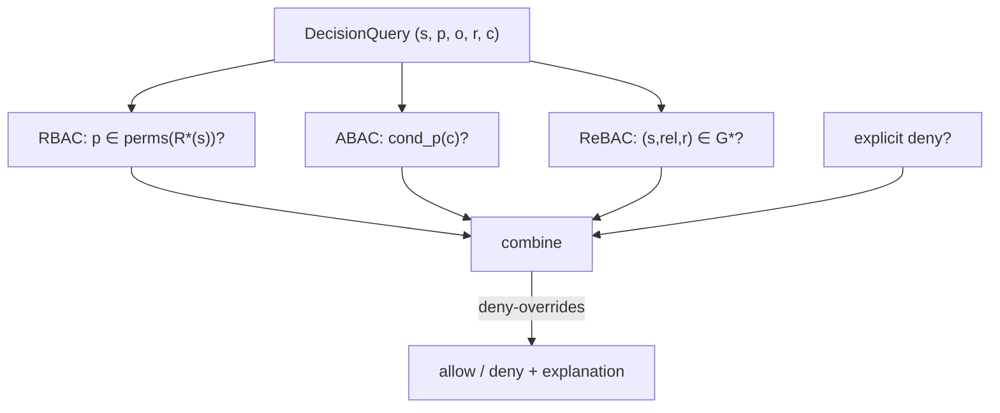

# Authorization models

`NativeSqlEngine` evaluates three classical authorization models in **one pass**. This page defines each
formally and shows how they combine. The runtime is in the [PDP decision pipeline](/architecture/pdp-pipeline).

## The decision, abstractly

A decision is a function of a subject $s$, a permission $p$, an organization $o$, an optional resource $r$
and a request context $c$:

$$
\text{decide}(s, p, o, r, c) \in \{\textsf{allow}, \textsf{deny}\}
$$

Three sources can each *grant*; the combiner is **deny-overrides**:

$$
\text{allow} \iff \big(\text{RBAC} \lor \text{ABAC} \lor \text{ReBAC}\big) \;\land\; \lnot\,\text{ExplicitDeny}
$$

## RBAC — role-based

The subject's roles — direct and inherited — grant permissions by slug. Let $R(s)$ be the role set assigned
to $s$, and let $\preceq$ be the role-inheritance order. The **role closure** is:

$$
R^{*}(s) = \{\, r' \mid \exists r \in R(s),\; r' \preceq r \,\}
$$

and $\text{perms}(R^{*}(s))$ is the union of the permissions those roles grant. RBAC grants $p$ iff
$p \in \text{perms}(R^{*}(s))$.

::: card "In this server" icon:users
Roles and their inheritance come from applied **manifests**. `warehouse:supervisor` that `inherits`
`warehouse:operator` contributes both role's permissions to the closure.
:::

## ABAC — attribute-based

A permission may carry a declared **condition** — a predicate over request attributes. `ConditionEvaluator`
evaluates it against the `context` $c$ you pass:

$$
\textsf{cond}_p(c) \in \{\textsf{true}, \textsf{false}\}, \qquad
\text{e.g. } (\texttt{amount} \le 1000)
$$

ABAC grants $p$ iff the subject holds $p$ **and** $\textsf{cond}_p(c) = \textsf{true}$. A held permission
with a failing condition does **not** grant — and the failed condition is reported in
`Decision::$failedConditions`.

::: card "In this server" icon:filter
Conditions are declared in the manifest as `{ "attr": ..., "op": ..., "value": ... }`. Supported operators
are deterministic comparisons (ordering, equality, membership, time windows) — no arbitrary code.
:::

## ReBAC — relationship-based

Access can follow from a **relationship** to a specific resource. Relationships are tuples
$(s, \text{rel}, r)$ in a graph $G$. ReBAC grants iff the requested relation is *reachable*:

$$
\text{ReBAC} \iff (s, \text{rel}, r) \in G^{*}
$$

where $G^{*}$ is the bounded closure under **group nesting**, **resource hierarchy** (`parent`) and
**relation implication** ($\textsf{owner} \supseteq \textsf{editor} \supseteq \textsf{viewer}$). The closure
is depth-bounded and cycle-guarded; exceeding the bound yields **deny**. Full treatment in
[ReBAC relationships](/guides/rebac-relationships).

## Combining them

The combiner is **monotone in deny**: adding any policy can only keep a result the same or turn it to deny.
That is what makes the engine safe to extend — a new policy can never silently widen access past an existing
deny.

::: collapsible "ADR — one engine, not three"
**Problem.** RBAC, ABAC and ReBAC are often separate systems, producing three answers a caller must
reconcile — and three audit trails.

**Decision.** Evaluate all three in a single `NativeSqlEngine::decide` pass that emits one `Decision` with
one `explanation` and one `decisionId`.

**Consequences.** A single, citable answer; deny-overrides applied uniformly across models; no reconciliation
bugs. The trade-off is a more complex engine, contained behind the `AuthorizationEngine` interface.
:::

::: callout warning "Holding a permission is necessary, not sufficient" icon:filter
RBAC establishes that a subject *could* hold $p$; ABAC conditions and explicit denies can still withhold it.
Never infer "allowed" from "has the role" — always ask the PDP with the real `context`.
:::

## Next

- [Deny-overrides & fail-closed](/concepts/deny-overrides-fail-closed) — the safety semantics in full.
- [Manifests & declared policy](/concepts/manifests) — where roles and conditions come from.
- [PDP decision pipeline](/architecture/pdp-pipeline) — the engine at runtime.
