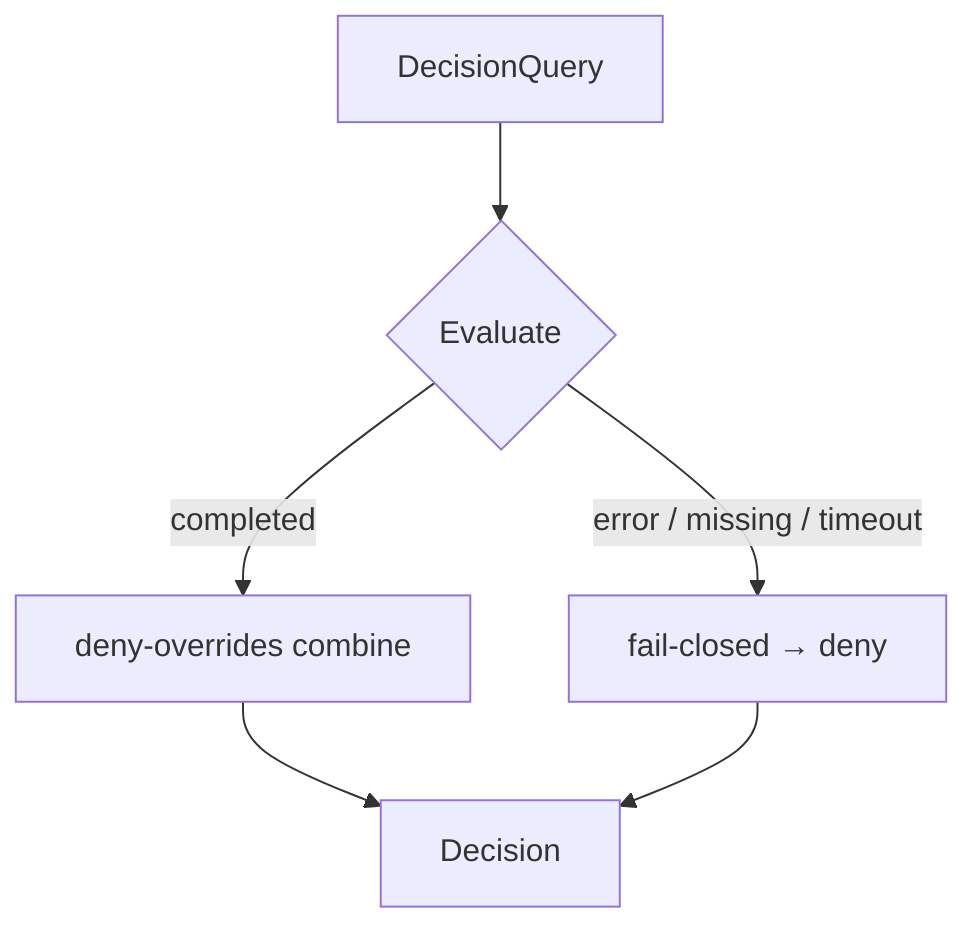

# Deny-overrides & fail-closed

Two properties make the PDP safe to trust. They are related but distinct, and confusing them causes real
vulnerabilities.

## Deny-overrides — the combining algorithm

When several policies apply to one request, you need a rule to combine their verdicts. The PDP uses
**deny-overrides**: an explicit deny wins over any number of permits.

Let $\Pi$ be the set of applicable policies, each yielding $\textsf{permit}$, $\textsf{deny}$ or
$\textsf{n/a}$. Then:

$$
\text{result} =
\begin{cases}
\textsf{deny}   & \text{if } \exists\,\pi \in \Pi : \pi = \textsf{deny} \\
\textsf{permit} & \text{else if } \exists\,\pi \in \Pi : \pi = \textsf{permit} \\
\textsf{deny}   & \text{otherwise (default-deny)}
\end{cases}
$$

Two consequences:

- **Default-deny.** No applicable permit means deny. Access is opt-in.
- **Monotone in deny.** Adding a policy can only preserve or tighten the result — never widen it. A
  relational permit can never override an explicit deny.

## Fail-closed — the error semantics

Deny-overrides is about *known* verdicts. **Fail-closed** is about the *unknown*: what happens when
evaluation cannot complete — malformed query, missing data, a thrown exception, a transport failure?

$$
\text{evaluation incomplete} \;\Rightarrow\; \textsf{deny}
$$

There is **no** path that turns an error into an allow, and **no** opaque 500 that a caller might
misinterpret. Every failure resolves to a clean deny.

## Why the distinction matters

| | Deny-overrides | Fail-closed |
|---|---|---|
| Concerns | Combining *known* verdicts | Handling the *unknown* |
| Failure mode it prevents | A stray permit widening access past a deny | An error being read as "allowed" |
| If you only had the other | An exception could still allow | A missing deny-combine could let a permit win wrongly |

You need **both**. Deny-overrides without fail-closed allows on error; fail-closed without deny-overrides
lets a permissive policy override an intended deny.

## In this server

- The combiner is deny-overrides across RBAC, ABAC and ReBAC — see
  [Authorization models](/concepts/authorization-models).
- Bounded ReBAC traversal that exceeds its depth/cycle cap returns **deny**, with the reason in the
  explanation.
- Cross-tenant access returns **404** (not 403) — a fail-closed *and* non-enumerating choice, covered in
  [Multi-tenancy & isolation](/concepts/multi-tenancy).

::: collapsible "ADR — fail-closed everywhere, no exceptions"
**Problem.** Code that authorizes is exactly the code where an unhandled error must not become an allow. A
single `catch` that returns `true` is a privilege leak.

**Decision.** Every authorization path resolves any error to deny. The engine never throws a decision; it
returns one. Tests assert the denial path for malformed input, missing data and exceptions.

**Consequences.** A bug degrades to "denied and logged", never to a silent leak. The cost is that a real
outage looks like "everything denied" — which is the safe failure direction and is visible in health checks.
:::

::: callout danger "Never catch-and-allow" icon:shield-alert
The single most dangerous anti-pattern in authorization code is `try { ... } catch (\Throwable) { return true; }`.
If you wrap a PDP call, the catch branch must **deny**. Treat a thrown or denied decision identically: "no".
:::

## Next

- [Authorization models](/concepts/authorization-models) — what deny-overrides combines.
- [Fail-closed design](/best-practices/fail-closed-design) — applying this in your own code.
- [Multi-tenancy & isolation](/concepts/multi-tenancy) — 404-not-403 as a fail-closed choice.
