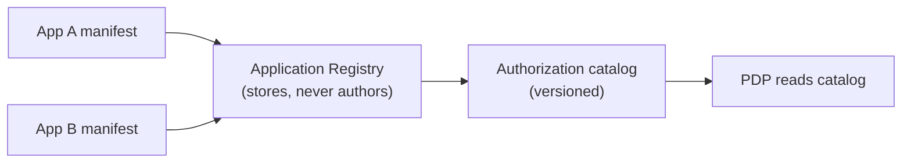

# Manifests & declared policy

The manifest is the package's central design choice: **applications declare their authorization vocabulary
as data**, and the core stores it without ever authoring it. This page is the *why*; the *how* is in
[Register an application](/guides/register-application).

## The principle

> The server is a generic policy *engine*. The policy *content* belongs to the apps.

A hardcoded permission table would couple every app's vocabulary to the server's release cycle. Declared
manifests invert that: each app owns its permissions/roles/scopes/conditions and submits them; the registry
**validates, diffs, approves, applies and can roll back**.

## What a manifest declares

| Element | Purpose |
|---|---|
| **Permissions** | Immutable slugs `app_key:permission`, optionally with an ABAC `condition` or a ReBAC `relation` binding. |
| **Roles** | Named bundles of permissions, composable via `inherits`. |
| **Scopes** | OAuth scopes the app exposes. |
| **Conditions** | Declarative attribute predicates (`{attr, op, value}`) — no code. |

## Why declared-as-data is safer

- **Reviewable.** A `diff` shows precisely what a change adds, removes or alters before it applies.
- **Reversible.** A `rollback` restores the previous applied manifest.
- **Versioned.** Each apply produces a catalog version, recorded in the decision (`policyVersion`) so you
  can attribute a past decision to the policy that made it.
- **Audited.** Every approve/apply/rollback is a hash-chained audit event.
- **Generic core.** The server never needs a release to support a new app's permissions.

## The immutability rule

A permission slug is an **identity**, not a label. Once shipped, it does not change meaning:

$$
\texttt{app\_key:permission} \;\longmapsto\; \text{one stable concept, forever}
$$

Renaming is modeled as *add new + migrate grants + remove old* — which the differ shows explicitly. This is
what lets historical decisions and audit entries stay meaningful.

::: collapsible "ADR — manifests as the policy boundary"
**Problem.** Where should the authority over "what permissions exist" live — in the server, or in the apps?

**Decision.** In the apps, as declared manifests; the server is the validating, diffing, versioning store
and the engine that reads them. The core hardcodes nothing.

**Consequences.** Apps evolve independently and safely; policy changes are governed (review + rollback +
audit); the engine stays generic. The cost is a submission/approval workflow — which is the governance you
want around authorization anyway.
:::

::: callout warning "Design the namespace before you ship" icon:lock
Because slugs are immutable, the `app_key:permission` namespace you ship is the one you live with. Prefer
specific, stable names (`warehouse:stock.adjust`) over broad ones you'll want to split later. The differ
will treat a rename as a remove + add.
:::

## Next

- [Register an application](/guides/register-application) — the manifest lifecycle in practice.
- [Authorization models](/concepts/authorization-models) — how the declared catalog is evaluated.
- [Data model](/architecture/data-model) — where the catalog and manifests are stored.
