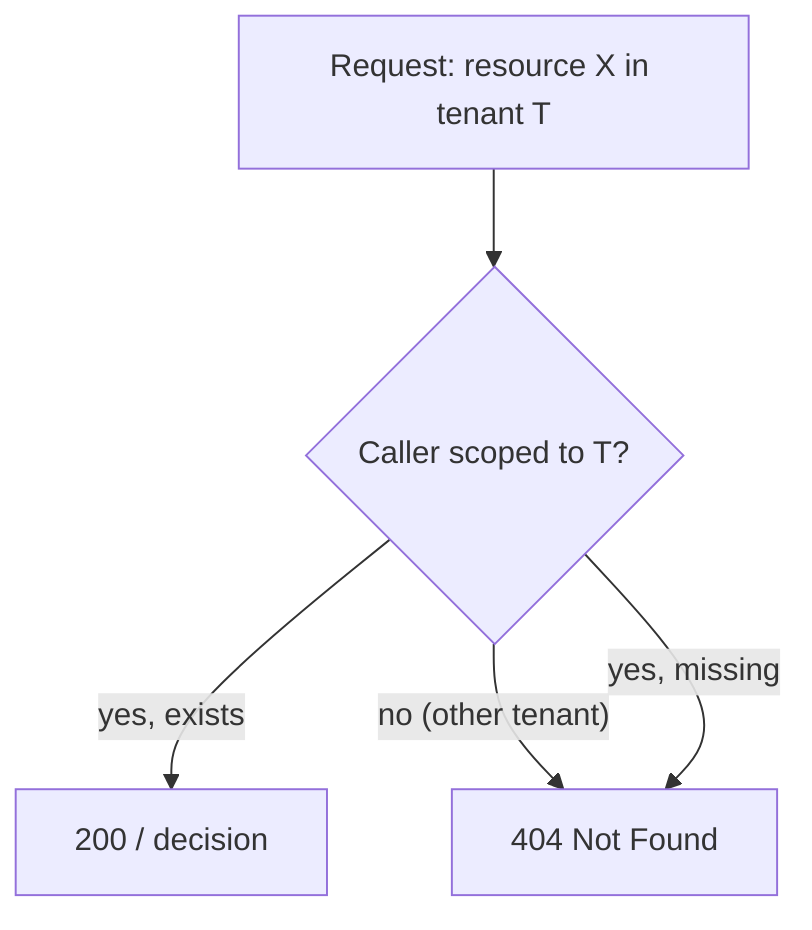

# Multi-tenancy & isolation

The server is multi-tenant: subjects, grants, resources and audit all live inside an **organization**
(`src/Domain/Organizations/`). Isolation between tenants is a hard invariant — and the way it fails is
deliberately chosen.

## Organizations are the boundary

Every decision is scoped by `organizationId`. A subject's grants in `org_A` are invisible in `org_B`; a
manifest applies within the org that owns the application. The PDP never considers cross-org grants:

$$
\text{decide}(s, p, o, \dots) \text{ only consults policy and grants within } o
$$

## 404, not 403

When a caller asks about a resource in a tenant they cannot see, the server returns **404 Not Found**, not
**403 Forbidden**.

::: callout danger "Why 404 and not 403" icon:eye-off
A 403 confirms the resource **exists** — it leaks information and enables enumeration ("which IDs return 403
vs 404?"). Returning 404 makes a cross-tenant resource **indistinguishable from one that does not exist**.
This is both a fail-closed and an anti-enumeration choice.
:::

The two "no resource for you" cases — *exists but other tenant* and *does not exist* — return the **same**
404. The caller learns nothing about resources outside its tenant.

## Isolation flows everywhere

- **Decisions** carry `organizationId`; grants and policy are filtered to it.
- **Admin API** reads are tenant-scoped; metrics aggregations (`/metrics/...`) are bounded and scoped.
- **Audit** entries record the org, so a tenant's history is its own.
- **ReBAC** tuples and groups are evaluated within the tenant boundary.

## Building correctly on top

If you write Admin API integrations or extend the server, preserve the invariant:

- Filter every query by the caller's organization.
- Return 404 for anything outside it — never 403, never a different error shape that reveals existence.
- Never let a list endpoint page across tenants.

::: callout warning "Tenant scoping is not optional middleware you can skip" icon:shield
Cross-tenant leakage is a top-severity bug in an IAM system. The package's tests assert the 404 behavior for
cross-tenant access; any code you add on top must keep it. Treat "could this return data from another org?"
as a release blocker.
:::

::: collapsible "ADR — 404 over 403 for cross-tenant"
**Problem.** 403 is the semantically "correct" HTTP status for "you may not", but it confirms existence and
enables enumeration across tenants.

**Decision.** Cross-tenant access returns 404, identical to a non-existent resource.

**Consequences.** No enumeration oracle; tenants cannot probe each other's ID space. The minor cost is that
a legitimately forbidden in-tenant action and a cross-tenant one can look the same — acceptable, since the
PDP already governs in-tenant authorization separately.
:::

## Next

- [Deny-overrides & fail-closed](/concepts/deny-overrides-fail-closed) — 404 as a fail-closed choice.
- [Securing the Admin API](/best-practices/securing-admin-api) — keeping tenant scope intact.
- [Architecture overview](/architecture/overview) — where organizations sit.
