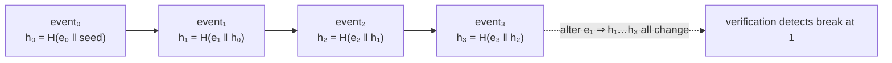

# Tamper-evident audit

An *append-only* log can still be edited by anyone with database access. A **tamper-evident** log makes any
such edit detectable. The server achieves this with a hash-chain. Audit code lives in `src/Domain/Audit/`.

## The hash-chain

Each event is hashed together with the hash of the **previous** event, forming a chain:

$$
h_i = H\big(\text{event}_i \,\Vert\, h_{i-1}\big)
$$

Changing, reordering or deleting any event $\text{event}_k$ changes $h_k$, which breaks every $h_i$ for
$i > k$. Verification recomputes the chain and reports the first break.



| Class | Role |
|---|---|
| `AuditHasher` | Computes the per-event hash. |
| `AuditChainAppender` | Appends an event, linking it to the prior hash. |
| `AuditChainVerifier` | Walks the chain and reports any break (`AuditVerificationResult`). |
| `AuditCheckpointer` | Periodic checkpoints so verification doesn't always start from genesis. |

## Verifying

```bash
curl -X POST https://iam.example.com/api/iam/v1/audit/verify-chain -H "Authorization: Bearer $ADMIN_TOKEN"
# or offline
php artisan iam:audit:verify --stream=global
```

A break means a row was altered or deleted out of band — the log is **tamper-evident**, not merely
append-only. Checkpoints (`php artisan iam:audit:checkpoint`) seal a stream up to a point so future
verification is cheaper.

## PII, GDPR & the chain

GDPR erasure conflicts with an immutable chain: you must *not* delete audit rows (it breaks verification),
yet you must be able to erase personal data. The resolution is **crypto-shredding**
(`src/Domain/Audit/Pii/`):

- PII is stored **encrypted** under a per-scope key.
- "Deletion" destroys the **key**, rendering the data unrecoverable — while the row, and therefore the
  chain, stay intact and verifiable.
- **Legal hold** exempts records from shredding until released.
- `ip_mode` controls whether/how client IPs are recorded.

$$
\text{erase PII} \;=\; \text{shred key } k_{\text{scope}} \quad(\text{not delete row})
$$

::: callout danger "Never hard-delete audit rows" icon:trash-2
Deleting a row to satisfy an erasure request breaks the hash-chain and destroys the tamper-evidence for
*every* later event. Use crypto-shredding: the event still exists and verifies, but the personal data is
gone.
:::

## Export & delivery

- **SIEM export** (`src/Domain/Audit/Export/`) — stream events to your security tooling.
- **Webhooks + outbox** — reliable at-least-once delivery, covered in
  [Webhooks & events](/guides/webhooks-and-events).
- CLI: `php artisan iam:audit:export`.

## What gets audited

Decisions (with their `decisionId`), manifest approvals/applies/rollbacks, grant changes, session
revocations, access-review certifications and access-request approvals — every state change carries an audit
entry. That is why [governance](/guides/access-reviews) can later prove who decided what.

::: collapsible "ADR — hash-chain + crypto-shredding instead of an immutable store"
**Problem.** Compliance wants immutability *and* a right-to-erasure. A write-once store gives the first and
forbids the second.

**Decision.** Keep rows immutable and tamper-evident via a hash-chain; make PII erasable by destroying its
encryption key (crypto-shredding) rather than the row.

**Consequences.** Verification stays valid after an erasure; legal hold suspends shredding when required.
The cost is per-scope key management — handled by the crypto layer.
:::

## Next

- [Audit & compliance](/best-practices/audit-and-compliance) — turning the chain into evidence.
- [Webhooks & events](/guides/webhooks-and-events) — delivering audit events reliably.
- [Configuration](/operations/configuration#audit) — audit, PII and `ip_mode` settings.
