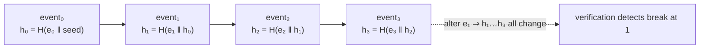

# Tamper-evident audit

An *append-only* log can still be edited by anyone with database access. A **tamper-evident** log makes any
such edit detectable. The server achieves this with a hash-chain. Audit code lives in `src/Domain/Audit/`.

## The hash-chain

Each event is hashed together with the hash of the **previous** event, forming a chain:

$$
h_i = H\big(\text{event}_i \,\Vert\, h_{i-1}\big)
$$

Changing, reordering or deleting any event $\text{event}_k$ changes $h_k$, which breaks every $h_i$ for
$i > k$. Verification recomputes the chain and reports the first break.


```mermaid
flowchart LR
    E0["event₀<br/>h₀ = H(e₀ ‖ seed)"] --> E1["event₁<br/>h₁ = H(e₁ ‖ h₀)"]
    E1 --> E2["event₂<br/>h₂ = H(e₂ ‖ h₁)"]
    E2 --> E3["event₃<br/>h₃ = H(e₃ ‖ h₂)"]
    E3 -.->|"alter e₁ ⇒ h₁…h₃ all change"| BREAK["verification detects break at 1"]
```

| Class | Role |
|---|---|
| `AuditHasher` | Computes the per-event hash — plain SHA‑256, or **HMAC‑SHA256** when a key is configured. |
| `AuditChainAppender` | Appends an event, linking it to the prior hash. |
| `AuditChainVerifier` | Walks the chain and reports any break (`AuditVerificationResult`). |
| `AuditCheckpointer` | Periodic **ES256-signed** checkpoints that both speed up verification and *anchor* the head. |

### Keyed chain (defence against a DB-write insider)

Plain SHA‑256 detects out-of-band edits, but an attacker who can *write* the audit table could recompute a
consistent forged chain. Set `iam.audit.chain_key` (`IAM_AUDIT_CHAIN_KEY`) to switch the hash to
**HMAC‑SHA256** with a secret kept outside the tables — now the chain can't be recomputed without the key.
It is **opt-in**: left empty the chain stays unkeyed, so turning it on later doesn't invalidate chains already
written (rotating the key requires a re-hash). Keep the key in a KMS/secret store in production.

## Verifying

```bash
curl -X POST https://iam.example.com/api/iam/v1/audit/verify-chain -H "Authorization: Bearer $ADMIN_TOKEN"
# or offline
php artisan iam:audit:verify --stream=global
```

A break means a row was altered or deleted out of band — the log is **tamper-evident**, not merely
append-only. Checkpoints (`php artisan iam:audit:checkpoint`) seal a stream up to a point so future
verification is cheaper.

The verify response carries **two** booleans, not one:

- **`valid`** — the chain recomputes cleanly (no tampered/reordered/deleted rows).
- **`anchored`** — a valid ES256-signed checkpoint anchors the chain **up to its sealed sequence**. A
  signature is the one artifact a DB-write insider can't forge. Note the boundary: `anchored: true` attests
  everything up to the *latest checkpoint*, not necessarily the current head — events appended after it are
  consistency-checked (against `iam_audit_heads`) but not themselves signed, so an insider could still forge
  *uncheckpointed tail* events unless the HMAC `chain_key` is set. `valid && !anchored` is honest: internally
  consistent, but resting on the writable DB alone. For compliance evidence, schedule `iam:audit:checkpoint`
  frequently so a fresh signature keeps re-anchoring the head, and set `chain_key` to protect the tail too.

## PII, GDPR & the chain

GDPR erasure conflicts with an immutable chain: you must *not* delete audit rows (it breaks verification),
yet you must be able to erase personal data. The resolution is **crypto-shredding**
(`src/Domain/Audit/Pii/`):

- PII is stored **encrypted** under a per-scope key.
- "Deletion" destroys the **key**, rendering the data unrecoverable — while the row, and therefore the
  chain, stay intact and verifiable.
- **Legal hold** exempts records from shredding until released.
- **IP/UA visibility** is opt-in per deployment: `IAM_AUDIT_IP_MODE` and `IAM_AUDIT_UA_MODE` each take
  `hash` (default — a salted one-way HMAC, privacy-preserving), `full` (clear IP/UA for forensics; needs the
  host's TrustProxies configured, and the value is surfaced only to `sessions.read`/`audit.read`) or `none`.
  `IAM_AUDIT_IP_PEPPER` is the secret salt for `hash` mode. Flipping the mode is not retroactive.

$$
\text{erase PII} \;=\; \text{shred key } k_{\text{scope}} \quad(\text{not delete row})
$$

::: callout danger "Never hard-delete audit rows" icon:trash-2
Deleting a row to satisfy an erasure request breaks the hash-chain and destroys the tamper-evidence for
*every* later event. Use crypto-shredding: the event still exists and verifies, but the personal data is
gone.
:::

## Export & delivery

- **SIEM export** (`src/Domain/Audit/Export/`) — stream events to your security tooling.
- **Webhooks + outbox** — reliable at-least-once delivery, covered in
  [Webhooks & events](/guides/webhooks-and-events).
- CLI: `php artisan iam:audit:export`.

## What gets audited

Every state change carries an audit entry: decisions (with their `decisionId`), manifest
approvals/applies/rollbacks, grant changes, session revocations, access-review certifications and
access-request approvals — plus the **authentication** events emitted by the host IdP:
`auth.login.succeeded` / `auth.login.failed`, `auth.logout`, `auth.stepup.failed`, and
`auth.2fa.enabled` / `auth.2fa.disabled`. That is why [governance](/guides/access-reviews) can later prove
who decided what.

Events are written to **per-purpose streams** (each an independent hash-chain), so you can verify or export
one concern at a time: `auth` (the sign-in/2FA events above), `admin` (grant/manifest/client changes),
`governance` (reviews/requests), and `global`. Pass the stream to `iam:audit:verify`/`:checkpoint`/`:export`
and to the Admin API's `GET /audit/events?stream=…` (it defaults to `global`).

::: collapsible "ADR — hash-chain + crypto-shredding instead of an immutable store"
**Problem.** Compliance wants immutability *and* a right-to-erasure. A write-once store gives the first and
forbids the second.

**Decision.** Keep rows immutable and tamper-evident via a hash-chain; make PII erasable by destroying its
encryption key (crypto-shredding) rather than the row.

**Consequences.** Verification stays valid after an erasure; legal hold suspends shredding when required.
The cost is per-scope key management — handled by the crypto layer.
:::

## Next

- [Audit & compliance](/best-practices/audit-and-compliance) — turning the chain into evidence.
- [Webhooks & events](/guides/webhooks-and-events) — delivering audit events reliably.
- [Configuration](/operations/configuration#audit) — audit, PII and `ip_mode` settings.
