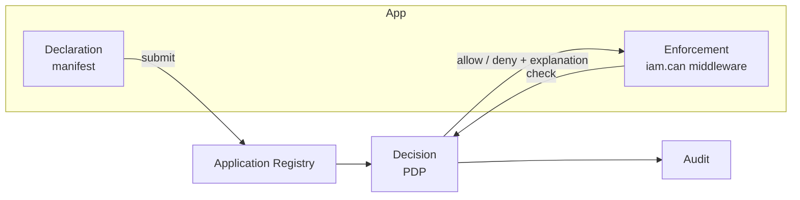

# Core concepts

This page is the mental model. Once these click, every subsystem page reads as a detail of the same idea.

## Declaration, decision, enforcement

Laravel IAM deliberately **separates three responsibilities** that most codebases tangle together:

- **Declaration** — each application ships a *manifest* of its permissions, roles, scopes and conditions.
- **Decision** — a single **Policy Decision Point (PDP)** evaluates a request against those policies.
- **Enforcement** — apps (via [`laravel-iam-client`](https://doc.laravel-iam-client.padosoft.com)) ask the
  PDP and allow/deny accordingly. They never re-implement the rules.



## Core entities

::: grids
  ::: grid
    ::: card "Subject" icon:user
    A `SubjectRef` is a `type:id` value object — `user:42`, `service_account:7`, `external_group:eng`. It is
    the single way every part of the system refers to *who* is acting.
    :::
  :::
  ::: grid
    ::: card "Permission & role" icon:key
    Permissions are immutable slugs `app_key:permission` (e.g. `warehouse:stock.adjust`). Roles bundle
    permissions. Both are introduced through an application's manifest — never hardcoded in the core.
    :::
  :::
  ::: grid
    ::: card "Organization" icon:building
    A tenant boundary. Subjects, grants and resources live inside an `organizationId`; cross-tenant access
    is indistinguishable from "does not exist".
    :::
  :::
  ::: grid
    ::: card "Decision" icon:scale
    A `DecisionQuery` (subject + permission + org + context + AAL) goes in; a `Decision` (allowed,
    decisionId, matched, explanation, requiresStepUp) comes out — deterministic and citable.
    :::
  :::
:::

## The three authorization models, in one engine

The PDP is **not** three engines bolted together. `NativeSqlEngine` evaluates all three in one pass:

| Model | Question it answers | How |
|---|---|---|
| **RBAC** | Does the subject hold a role that grants this permission? | Roles (direct + inherited) → permission slugs |
| **ABAC** | Do the request *attributes* satisfy the permission's condition? | `ConditionEvaluator` checks the declared `condition` against your `context` |
| **ReBAC** | Does a *relationship* to this specific resource grant it? | Graph lookup over `(subject, relation, object)` tuples in `iam_relations` |

The full theory is in [Authorization models](/concepts/authorization-models); the runtime flow is in the
[PDP decision pipeline](/architecture/pdp-pipeline).

## An attribute condition, end to end

A manifest can attach an ABAC condition to a permission:

```jsonc
{ "key": "warehouse:stock.adjust",
  "condition": { "attr": "amount", "op": "<=", "value": 1000 } }
```

The caller passes `context: ['amount' => 500]`; the PDP's `ConditionEvaluator` checks it. `amount = 5000`
is denied even for a user who otherwise holds the permission. The permission slug never changes — only the
declared condition gates it.

## The invariants — never violate these

::: callout danger "House rules"
1. **Never bypass the PDP.** A local `if ($user->isAdmin())` is a privilege leak. The PDP is the only
   allow/deny authority.
2. **Fail-closed.** Any error — bad input, missing policy, transport failure — resolves to **deny**, never
   to allow and never to an opaque 500.
3. **Deny-overrides.** If *any* applicable policy denies, the result is deny.
4. **Cross-tenant returns 404, not 403.** A 403 confirms the resource exists. Return **404**.
5. **Permission slugs are immutable** (`app_key:permission`); declared by apps, never hardcoded.
6. **Every mutation is audited** (hash-chained, verifiable).
7. **No UI reads the DB** — only the Admin API.
8. **OIDC layer is MIT** (steverhoades); AGPL code is forbidden; OAuth stays `league/oauth2-server`.
:::

## Why it's built this way

One decision point means one place to reason about, test, explain and audit access. Declaring policies in
manifests keeps the core generic and lets apps evolve their own permissions safely (validated, diffed,
rollback-able). Fail-closed + hash-chained audit means a mistake degrades to "denied and logged", not to a
silent privilege leak. These choices are recorded as [architecture decisions](/architecture/decisions).

## Next

- [Manifests & declared policy](/concepts/manifests) — how apps declare what they need.
- [Deny-overrides & fail-closed](/concepts/deny-overrides-fail-closed) — the safety contract, formally.
- [Architecture overview](/architecture/overview) — how the subsystems fit together.
