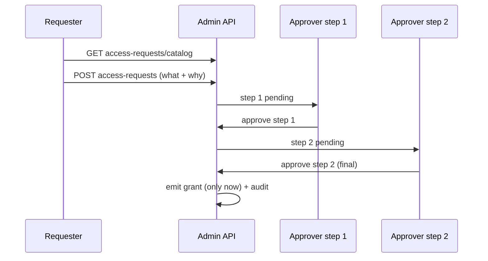

# Access requests

Access requests are the self-service side of governance: a user asks for access, an approver (or a chain of
them) decides, and only then is a grant emitted. Code lives in `src/Domain/Governance/Requests/`.

## Motivation

The opposite of an access review: instead of certifying existing access, users *request* new access against
a catalog, and the grant is created through an auditable approval — not by an engineer running SQL.

## The flow



::: steps
1. **Browse the catalog** of requestable access:
   ```bash
   curl https://iam.example.com/api/iam/v1/access-requests/catalog -H "Authorization: Bearer $ADMIN_TOKEN"
   ```
2. **Submit a request:**
   ```bash
   curl -X POST https://iam.example.com/api/iam/v1/access-requests \
     -H "Authorization: Bearer $ADMIN_TOKEN" -d '{"subject":"user:42","access":"warehouse:operator","reason":"on-call rotation"}'
   ```
3. **Approve / reject** — single decision or a step in a chain:
   ```bash
   curl -X POST https://iam.example.com/api/iam/v1/access-requests/{r}/approve -H "Authorization: Bearer $ADMIN_TOKEN"
   curl -X POST https://iam.example.com/api/iam/v1/access-requests/{r}/reject  -H "Authorization: Bearer $ADMIN_TOKEN"
   ```
:::

## Multi-step approver chains (M17)

Some access needs more than one approval. The approver-chain API models a **sequential AND**: each step must
approve, and the grant is emitted **only at the final step**:

```bash
curl https://iam.example.com/api/iam/v1/access-requests/{r}/steps -H "Authorization: Bearer $ADMIN_TOKEN"
curl -X POST https://iam.example.com/api/iam/v1/access-requests/{r}/steps/{s}/approve -H "Authorization: Bearer $ADMIN_TOKEN"
curl -X POST https://iam.example.com/api/iam/v1/access-requests/{r}/steps/{s}/reject  -H "Authorization: Bearer $ADMIN_TOKEN"
```

Steps are stored in `iam_approval_steps`. A reject at any step ends the request with no grant.

::: callout warning "No double-grant" icon:lock
Approvals run under a lock (`DB::transaction` + `lockForUpdate` + re-check), so two concurrent approvals of
the same step can't double-grant. The grant is idempotent on the final step.
:::

## Feature gating

Access requests are **off by default** (privacy-by-default: the catalog is empty until enabled) —
`iam-governance.php` → `features.access_request`, permission `iam:access_request.use`. Enable it per scope
through `NativeFeatureScope`. PIM (just-in-time elevation) is a related, also-off-by-default feature
(`features.pim`).

## Next

- [Access reviews](/guides/access-reviews) — the certification side.
- [Least-privilege & SoD](/best-practices/least-privilege-and-sod) — keeping granted access tight.
- [Admin API reference](/reference/admin-api) — the full access-requests surface.
