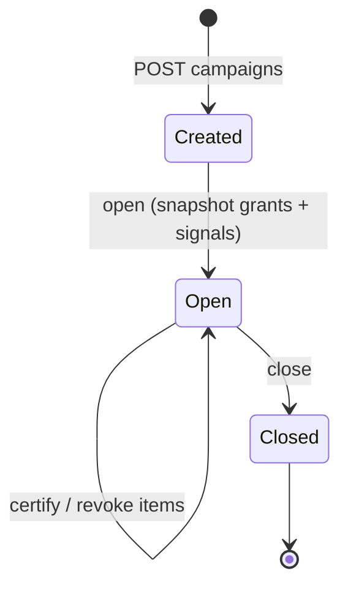

# Access reviews

Access reviews (access certification) are how you periodically prove that the people who *have* access still
*need* it. The server runs them as **campaigns** over a frozen snapshot. Code lives in
`src/Domain/Governance/Reviews/`.

## Motivation

Grants accumulate. People change teams, projects end, contractors leave — but their access lingers. An
auditor will ask "who reviewed this access, and when?". A campaign produces exactly that evidence: a dated,
signed certify/revoke decision per access item.

## The lifecycle



::: steps
1. **Create & open a campaign**
   ```bash
   curl -X POST https://iam.example.com/api/iam/v1/access-reviews/campaigns \
     -H "Authorization: Bearer $ADMIN_TOKEN" -d '{"name":"Q3 warehouse review","scope":{...}}'
   curl -X POST https://iam.example.com/api/iam/v1/access-reviews/campaigns/{campaign}/open \
     -H "Authorization: Bearer $ADMIN_TOKEN"
   ```
   `CampaignEngine` generates items (subject × access) and **freezes** a snapshot of grants and signals.

2. **Review items with context.** `ReviewSignals` attaches risk signals — unused grants, anomalies — to
   each item so reviewers decide with evidence:
   ```bash
   curl https://iam.example.com/api/iam/v1/access-reviews/campaigns/{campaign}/items \
     -H "Authorization: Bearer $ADMIN_TOKEN"
   ```

3. **Certify or revoke** each item (both audited):
   ```bash
   curl -X POST https://iam.example.com/api/iam/v1/access-reviews/items/{item}/certify -H "Authorization: Bearer $ADMIN_TOKEN"
   curl -X POST https://iam.example.com/api/iam/v1/access-reviews/items/{item}/revoke  -H "Authorization: Bearer $ADMIN_TOKEN"
   ```

4. **Close the campaign:**
   ```bash
   curl -X POST https://iam.example.com/api/iam/v1/access-reviews/campaigns/{campaign}/close -H "Authorization: Bearer $ADMIN_TOKEN"
   ```
:::

From the CLI: `php artisan iam:reviews:open --campaign=...`, `iam:reviews:remind --campaign=...`,
`iam:reviews:close --campaign=...`.

## Snapshot, not live data

::: callout tip "A campaign evaluates a frozen snapshot" icon:camera
Removing a role from the catalog after a campaign opens must **not** retroactively change its outcome — and
must never leave a permanent orphan grant. The campaign decides against the grants and signals as they were
when it opened.
:::

## Feature gating

Access reviews are a governance feature gated per layer / app / role / user via `NativeFeatureScope`. The
default is `on` (`iam-governance.php` → `features.access_review`, permission
`iam:access_review.manage`). See [Configuration](/operations/configuration#governance).

::: callout warning "State transitions are locked" icon:lock
Opening, closing and item decisions are read-then-write transitions. The server runs them under
`DB::transaction` + `lockForUpdate` + re-check, so two concurrent closes or a late catalog change can't
produce orphan grants or double certifications. This is a hard TOCTOU invariant of the package.
:::

## Next

- [Access requests](/guides/access-requests) — the request/approval side of governance.
- [Least-privilege & SoD](/best-practices/least-privilege-and-sod) — feeding reviews with risk signals.
- [Audit & compliance](/best-practices/audit-and-compliance) — turning campaigns into evidence.
