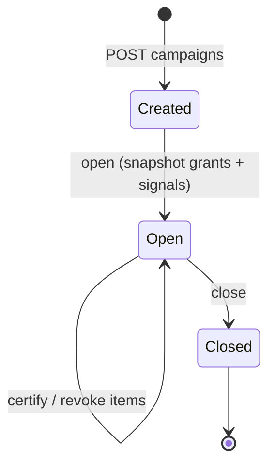

# Access reviews

Access reviews (access certification) are how you periodically prove that the people who *have* access still
*need* it. The server runs them as **campaigns** over a frozen snapshot. Code lives in
`src/Domain/Governance/Reviews/`.

## Motivation

Grants accumulate. People change teams, projects end, contractors leave — but their access lingers. An
auditor will ask "who reviewed this access, and when?". A campaign produces exactly that evidence: a dated,
signed certify/revoke decision per access item.

## The lifecycle


```mermaid
stateDiagram-v2
    [*] --> Created: POST campaigns
    Created --> Open: open (snapshot grants + signals)
    Open --> Open: certify / revoke items
    Open --> Closed: close
    Closed --> [*]
```

::: steps
1. **Create & open a campaign**
   ```bash
   curl -X POST https://iam.example.com/api/iam/v1/access-reviews/campaigns \
     -H "Authorization: Bearer $ADMIN_TOKEN" -d '{"name":"Q3 warehouse review","scope":{...}}'
   curl -X POST https://iam.example.com/api/iam/v1/access-reviews/campaigns/{campaign}/open \
     -H "Authorization: Bearer $ADMIN_TOKEN"
   ```
   `CampaignEngine` generates items (subject × access) and **freezes** a snapshot of grants and signals.

2. **Review items with context.** `ReviewSignals` attaches risk signals — unused grants, anomalies — to
   each item so reviewers decide with evidence:
   ```bash
   curl https://iam.example.com/api/iam/v1/access-reviews/campaigns/{campaign}/items \
     -H "Authorization: Bearer $ADMIN_TOKEN"
   ```

3. **Certify or revoke** each item (both audited):
   ```bash
   curl -X POST https://iam.example.com/api/iam/v1/access-reviews/items/{item}/certify -H "Authorization: Bearer $ADMIN_TOKEN"
   curl -X POST https://iam.example.com/api/iam/v1/access-reviews/items/{item}/revoke  -H "Authorization: Bearer $ADMIN_TOKEN"
   ```

4. **Close the campaign:**
   ```bash
   curl -X POST https://iam.example.com/api/iam/v1/access-reviews/campaigns/{campaign}/close -H "Authorization: Bearer $ADMIN_TOKEN"
   ```
:::

From the CLI: `php artisan iam:reviews:open --campaign=...`, `iam:reviews:remind --campaign=...`,
`iam:reviews:close --campaign=...`.

## What a campaign certifies — beyond grants

A campaign certifies **reviewable sources**, not only `iam_grants`. A source is a category of access
that knows how to read its own inventory and how to revoke; the engine orchestrates the campaign
without knowing what it is looking at.

Grants are the built-in source. An optional module registers its own — first among them
[`laravel-iam-agents`](https://doc.laravel-iam-agents.padosoft.com), whose **delegation grants** (an
AI agent allowed to act on behalf of a user) are accesses in every meaningful sense, and are far
easier to forget than a role: nobody leaves the company on an agent's behalf.

Include them explicitly in `scope_json`:

```json
{
  "name": "Q3 — people and agents",
  "on_unconfirmed": "revoke",
  "scope_json": { "reviewable_types": ["grant", "delegation_grant"] }
}
```

::: callout warning "Absent means grants only, deliberately" icon:shield
A campaign whose scope does not name `reviewable_types` certifies **grants only** — exactly as it did
before sources existed. Installing a module must never make new items appear inside campaigns
somebody has already planned and scheduled.
:::

Items therefore carry `reviewable_type` + `reviewable_id` instead of a `grant_id`, and each source
supplies the summary fields the admin API returns. A source names them so that one table renders
every kind: `subject_type`, `subject_id`, `privilege_type`, `privilege_key`, `application_key`,
`effect`, plus whatever is specific to it.

### Registering your own source

Implement `ReviewableSource` and register it from your service provider:

```php
use Padosoft\Iam\Domain\Governance\Reviews\Reviewable\ReviewableRegistry;

$this->app->make(ReviewableRegistry::class)->register(new MyReviewableSource);
```

The contract is four methods: `type()` (the discriminator persisted on the item — **stable forever**,
since changing it orphans historical evidence), `label()`, `scoped(ReviewCampaign)` yielding
`ReviewableRef`s with the reviewer and signals already resolved, `revoke()`, and `describeMany()`.

Revocation belongs to the source, not to the engine: only the source knows its own domain's
invariants — idempotency, events, its own audit `event_type`. The engine hands it the campaign
context so it lands in the metadata.

::: callout danger "An item whose source is gone is never marked revoked" icon:file-warning
If the module that created an item is uninstalled, the access is no longer revocable. Such an item
stays **pending**, is audited as `iam.access_review.item_unrevocable`, and does not block the
campaign from closing for everything else. Marking it `revoked` anyway would write a revocation that
never happened into the audit trail — the one thing an IGA system cannot afford.
:::

## Snapshot, not live data

::: callout tip "A campaign evaluates a frozen snapshot" icon:camera
Removing a role from the catalog after a campaign opens must **not** retroactively change its outcome — and
must never leave a permanent orphan grant. The campaign decides against the grants and signals as they were
when it opened.
:::

## Feature gating

Access reviews are a governance feature gated per layer / app / role / user via `NativeFeatureScope`. The
default is `on` (`iam-governance.php` → `features.access_review`, permission
`iam:access_review.manage`). See [Configuration](/operations/configuration#governance).

::: callout warning "State transitions are locked" icon:lock
Opening, closing and item decisions are read-then-write transitions. The server runs them under
`DB::transaction` + `lockForUpdate` + re-check, so two concurrent closes or a late catalog change can't
produce orphan grants or double certifications. This is a hard TOCTOU invariant of the package.
:::

## Next

- [Access requests](/guides/access-requests) — the request/approval side of governance.
- [Least-privilege & SoD](/best-practices/least-privilege-and-sod) — feeding reviews with risk signals.
- [Audit & compliance](/best-practices/audit-and-compliance) — turning campaigns into evidence.
- [Access reviews for delegations](https://doc.laravel-iam-agents.padosoft.com/guides/access-review) — the agents source.
