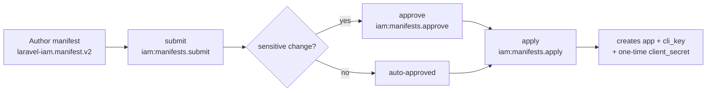

# Application credentials & lifecycle

This is the **single source of truth** for how a third-party application obtains, uses, rotates and retires
its OAuth credentials against Laravel IAM. It answers the questions a security/ops reviewer always asks:
*who can register an app, is there a gate, how are secrets issued, do they expire, how do I rotate them
without breaking the app, and can it be automatic?*

## TL;DR

- **Onboarding is admin-gated.** A random OIDC app **cannot** self-register. An OAuth client only exists after
  an **admin** submits an application **manifest** → (approves) → **applies** it. There is **no** Dynamic
  Client Registration endpoint.
- **IAM issues the credential.** Apply mints a `client_id` (`cli_<key>`) and, for a confidential client, a
  one-time `client_secret` (stored **hashed**). The app stores it and presents it at `/oauth/token`.
- **Secrets can be rotated with zero downtime.** Rotation issues a new secret while the previous one stays
  valid for a **grace window** — the app rolls over without an outage.
- **Rotation is manual (admin) or automatic (scheduler).** Auto-rotation is opt-in per client; the app
  **self-fetches** the new secret during the grace and hot-swaps — no admin, no downtime.
- **Expiry is soft + alerted.** An optional scheduled expiry drives console alerts (banner + dashboard); the
  secret keeps working so an un-rotated app never breaks unexpectedly. Only the **grace** end is a hard cut-off.
- **On a leak, revoke** — don't rely on rotation. Revocation kills the client (and its self-fetch) immediately.

## 1. Onboarding — the security gate



- **submit / approve / apply are three separate permissions** (separation of duties), all behind
  `AdminAuthenticate`, fail-closed. Sensitive changes (new confidential client, new `redirect_uris`,
  high/critical permissions) require an explicit **approve**.
- **Apply returns the one-time secret** (new confidential client). Capture it — it's shown once, never
  re-shown, never written to the audit log:

  ```json
  { "data": { "client_id": "cli_warehouse", "client_secret": "SHOWN-ONCE", "application_id": "app_…" } }
  ```

- In the console: **Applications → Register / update app** does submit → approve → apply and shows the secret.
  From the CLI: `iam:manifest:apply manifest.json --approve` prints it once.
- An unknown `client_id` at `/authorize` or `/token` is rejected (`invalid_client`, fail-closed). See
  [Register an application](/guides/register-application) for the manifest format.

## 2. Client authentication

A confidential client presents `client_id` + `client_secret` (`client_secret_basic` or `client_secret_post`);
the secret is verified against its **hash**. A public client has no secret and is protected by **PKCE (S256)**
and an exact-match `redirect_uris` allow-list. See [OAuth clients](/guides/oauth-clients).

## 3. Scheduled expiry & alerts

Set `IAM_OAUTH_CLIENT_SECRET_TTL` (seconds) to give newly-issued secrets a lifetime. Then:

- `GET /api/iam/v1/applications/{app}/client` reports `secret_status` (`ok` · `expiring` · `expired` ·
  `revoked` · `public`), `secret_expires_at`, `grace_active`/`grace_until`, and `auto_rotate`.
- `GET /api/iam/v1/metrics/clients` aggregates counts (`expired`, `expiring`, `in_grace`, `needs_rotation`)
  + the most-urgent items. The console surfaces this as a **global banner** and a **Dashboard widget**.
- Expiry is **soft**: the secret keeps authenticating past `secret_expires_at` (so nothing breaks by
  surprise). The alert is your cue to rotate. `IAM_OAUTH_CLIENT_SECRET_WARN_DAYS` (default 14) sets the
  "expiring soon" threshold.

## 4. Manual rotation (zero downtime)

```bash
curl -X POST https://iam.example.com/api/iam/v1/applications/warehouse/rotate-secret -H "Idempotency-Key: $(uuidgen)"
# → { "data": { "client_id": "cli_warehouse", "client_secret": "NEW-ONCE", "grace_until": "…" } }
```

Rollover: **rotate → deploy the new secret during the grace (`IAM_OAUTH_CLIENT_SECRET_GRACE`, default 72h) →
the old one stops after the grace.** `validateClient` accepts **either** secret while the grace is open.
Rotations are **serialized** — a second rotation while a grace is active is rejected (409) so the original
secret is never orphaned. Requires `iam:clients.manage`. In the console: **Applications → Details → OAuth
client → Rotate secret**.

## 5. Automatic rotation + app self-fetch (no admin, no downtime)

Opt a client in via the **manifest** (the registry owns the client):

```json
"auth": {
  "client_type": "confidential",
  "redirect_uris": ["https://warehouse.example.com/callback"],
  "auto_rotate": true,
  "rotate_interval_days": 90
}
```

Then:

1. **Schedule** the rotator (host): `Schedule::command('iam:rotate-due-secrets')->daily();` — it rotates the
   clients whose interval elapsed and clears pending ciphertexts whose grace has lapsed.
2. On rotation the new secret is stored **encrypted at rest** (no human receives it) and the previous secret
   stays valid for the grace.
3. **Enable the self-fetch endpoint**: `IAM_OAUTH_CLIENT_SELFFETCH=true` (opt-in, off by default).
4. The app fetches the new secret with its **still-valid current secret** and hot-swaps:

   ```bash
   curl -X POST https://iam.example.com/oauth/client-secret -u "cli_warehouse:$CURRENT_SECRET"
   # → { "rotated": true, "client_secret": "NEW", "grace_until": "…" }   (or { "rotated": false })
   ```

   The pickup is **one-time** (the pending is cleared on first fetch) and the response carries
   `Cache-Control: no-store`. Only the legitimate client — holding a valid secret — can retrieve the rotated
   one (`validateClient` is the gate; there is no user/PDP auth here, it's client authentication).
   `laravel-iam-client` performs this fetch-and-swap automatically; any app can do it with a small scheduled call.

:::warning Auto-rotation is hygiene, not incident response
Auto-rotation bounds a secret's lifetime; it does **not** evict a silent leak (a leaked old secret can, during
the grace, self-fetch the new one). On a **suspected compromise, revoke** — do not rely on rotation.
:::

## 6. Revocation

```bash
curl -X POST https://iam.example.com/api/iam/v1/applications/warehouse/revoke-client -H "Idempotency-Key: $(uuidgen)"
```

Immediate and fail-closed: a revoked client never authenticates and its self-fetch/rotate are refused.
Requires `iam:clients.manage`. In the console: **Details → OAuth client → Revoke client**.

## 7. Expiry reference

| Credential / token | Lifetime | Config |
|---|---|---|
| `client_secret` | **no expiry** unless a TTL is set (soft, alert-only) | `IAM_OAUTH_CLIENT_SECRET_TTL` |
| grace (previous secret) | **72h** (hard cut-off) | `IAM_OAUTH_CLIENT_SECRET_GRACE` |
| access_token / id_token | 15 min | `iam.tokens.access_ttl` |
| refresh_token | 14 days | `iam.tokens.refresh_ttl` |
| authorization code | 10 min | `iam.oauth.auth_code_ttl` |

## 8. No secret at all — `private_key_jwt`

For a shared secret you never want to manage, asymmetric **`private_key_jwt` (RFC 7523) is shipped**: the app
signs a client assertion with its **private key** while IAM verifies it against the **registered public key**
(JWKS) — no shared secret to issue, rotate, or leak. Enabled per client via `auth.token_endpoint_auth_method
= "private_key_jwt"` in the manifest; assertion lifetime is bounded by `IAM_OAUTH_CLIENT_ASSERTION_MAX_LIFETIME`
(seconds, default 300) and each `jti` is single-use. Full guide:
[private_key_jwt](/guides/private-key-jwt).
