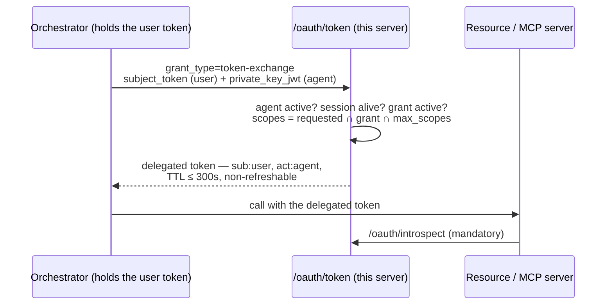

# Delegated access (AI agents)

## Motivation

An AI agent that acts for a user must never hold the user's own token: that token grants *everything* the
user can do, for its whole lifetime, with no way to distinguish "the user did this" from "the agent did
this" — and no way to stop the agent without logging the user out.

The optional module [`padosoft/laravel-iam-agents`](https://github.com/padosoft/laravel-iam-agents)
(precedent: `laravel-iam-directory`) turns agents into **first-class identities** with an OAuth 2.0 Token
Exchange ([RFC 8693](https://datatracker.ietf.org/doc/html/rfc8693)) flow on this server's own token
endpoint:

**The invariant everything enforces:** a delegated token carries two identities (`sub` = user, `act` =
agent), and effective authority is the **strict intersection** of what the user and the agent may do —
never the union, evaluated fresh by the PDP, fail-closed. Short TTL and no refresh are deliberate: the
re-exchange *is* the revocation freshness check.

## What the module brings

- **Agent registry** — lifecycle `pending → active` (human approval only: approving creates the agent's
  OAuth client, confidential, `private_key_jwt`, token-exchange grant only) `→ suspended / retired`.
- **Delegation grants** — the user's consent: agent, scopes (⊆ the agent's `max_scopes`), purpose,
  expiry, consent evidence (AAL + confirmation id). PSD2-grade consent via `rebel-step-up` dynamic
  linking, or the built-in IAM-native verifier.
- **Delegated PDP** — `checkDelegated()` as a decorator over the engine: user check ∧ agent check ∧ grant
  still active, sub-decision ids cited, deny-overrides on every layer.
- **Gated agentic registration** — RFC 7591 DCR + `auth.md`/ID-JAG discovery, off by default; every
  registration lands `pending` with zero scopes until a human approves.
- **Audit stream `delegation`** — every exchange (issued *and* refused), grant create/revoke, lifecycle
  transition, sealed in the tamper-evident chain and pushed to webhook subscribers.

## The four core seams it plugs into

The module registers its RFC 8693 grant from the outside — `app()->extend(AuthorizationServer::class)` —
and the core provides exactly four small, additive seams:

| Seam | What it is |
| --- | --- |
| **`TokenIssuanceContext`** (P1) | Request-scoped, reset-per-request singleton (pattern: `OidcContext`) through which a grant contributes extra claims (`act`, `aud`), a `typ` header, and allow-listed response params (`issued_token_type`). Reserved claims (`sub`, `iss`, `scope`, `sid`, …) are rejected with a throw. |
| **`app.type = agent`** (P3) | Manifest-provisioned agents get ONLY the token-exchange grant URN and MUST use `private_key_jwt` — no auth-code (agents don't log in interactively), no refresh (delegated tokens are re-exchanged). |
| **Revocation push** (P2) | Every sealed audit event is pushed to matching webhook subscriptions — see [Webhooks & events](/guides/webhooks-and-events). A grant revocation reaches PEPs and agents without waiting for a poll. |
| **`GET /capabilities`** (P4) | Optional modules declare themselves via `config('iam.capabilities.*')` at boot; the console shows/hides its Agents/Delegations pages without probing endpoints for 409s. |

## v1.1 — budgets, JIT elevation, and the guarded stream

The module's v1.1 completes the loop around the same exchange and audit stream this server hosts:

- **Budget-bounded delegation** — *scopes bound authority, budgets bound intensity*: a grant can carry
  €/token/call caps, approved inside the same cryptographically bound consent. Enforcement is
  **fail-closed at exchange**: a budgeted grant with no `DelegationBudgetGuard` bound is refused
  (`delegation_budget_unenforceable`); the reference meter is
  [`laravel-ai-finops`](https://github.com/padosoft/laravel-ai-finops) ≥ 1.6, which sums its usage
  ledger per grant — an exhausted budget stops the agent within one token TTL, because the re-exchange
  is the checkpoint.
- **JIT scope elevation** — an action outside the grant no longer dies on a flat deny: the agent opens an
  elevation request (extra scopes + reason), the delegating user is nudged out-of-band
  ([`laravel-rebel-channels`](https://github.com/padosoft/laravel-rebel-channels) ≥ 0.1.3, best-effort and
  informative only) and approves with a **bound step-up re-consent** — the agent's `max_scopes` ceiling
  stays uncrossable, pending requests self-expire, denying is one click.
- **Anomaly detection with opt-in auto-suspend** —
  [`laravel-rebel-ai-guard`](https://github.com/padosoft/laravel-rebel-ai-guard) ≥ 0.1.3 reads this
  server's `iam_audit_events` (stream `delegation`): exchange bursts and scope probing open cases, and —
  only with an explicit opt-in — High/Critical cases suspend the agent through the `AgentLifecycle` port
  (the transition is audited here like any admin suspend).
- **EU AI Act evidence** —
  [`laravel-ai-act-compliance`](https://github.com/padosoft/laravel-ai-act-compliance) ≥ 1.8 turns the
  module's domain events into Art. 14 human-oversight records (grants, with the consent evidence) and
  Art. 6 risk-register entries (approved agents, lifecycle-tracked).

Everything above rides the seams already described: the exchange refusals land in the `delegation`
audit stream with their precise reason, and the console shows grant budgets and pending elevations next
to the kill-switch. Full mechanics:
[Budget & elevation](https://doc.laravel-iam-agents.padosoft.com/guides/budget-and-elevation).

## Verifying delegated tokens (resource-server side)

Delegated tokens are **introspection-mandatory**: a resource server that accepts delegation calls
`/oauth/introspect` (which also checks that the delegating user's session is still alive) rather than
trusting local claims parsing. `padosoft/laravel-iam-client` ships this ready-made — the
`iam.can.delegated` middleware and `Iam::checkDelegated()` (see the
[client's delegated-access guide](https://doc.laravel-iam-client.padosoft.com/guides/delegated-access)).
The `typ: delegated+jwt` header is hygiene, never the defence.

## See also

- [`laravel-iam-agents` docs](https://doc.laravel-iam-agents.padosoft.com) — the module's own site:
  quickstart, glossary, intersection rule, consent verifiers, threat model, every RFC 8693 error
  explained ([README](https://github.com/padosoft/laravel-iam-agents) for the feature tour and the
  WorkOS / Auth0 comparison).
- [Webhooks & events](/guides/webhooks-and-events) — the push channel revocations ride on.
- [private_key_jwt](/guides/private-key-jwt) — the only client auth agents are allowed.
- [Sessions & step-up](/guides/sessions-and-step-up) — session liveness, which every exchange re-checks.
