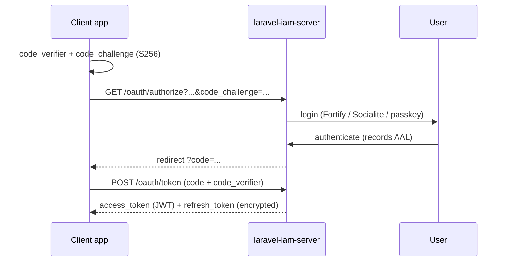

# OAuth2 clients & PKCE

The server is a full OAuth2 identity provider built on
[`league/oauth2-server`](https://oauth2.thephpleague.com/) — **not** Passport. This guide covers the grant
flows it issues. OAuth code lives in `src/Domain/OAuth/`.

## Grants

Enabled in `config/iam.php` under `oauth.grants`:

| Grant | Use | Default |
|---|---|---|
| `authorization_code` (+ PKCE) | Interactive apps & SPAs | on |
| `client_credentials` | Service-to-service | on |
| `refresh_token` | Long-lived sessions, encrypted & rotated | on |

PKCE (`S256`) is **required for public clients** (`oauth.require_pkce`). Auth-code TTL defaults to 10
minutes (`oauth.auth_code_ttl`), and the OAuth endpoints are rate-limited (`oauth.rate_limit`, default
60/min).

## Authorization-code + PKCE flow



::: steps
1. **Generate the PKCE pair** in the client (`code_verifier`, then `code_challenge = S256(verifier)`).
2. **Redirect to authorize**
   ```
   GET https://iam.example.com/oauth/authorize
       ?response_type=code&client_id=warehouse-spa
       &redirect_uri=https://app.example.com/callback
       &scope=openid%20profile&code_challenge=...&code_challenge_method=S256
   ```
3. **Exchange the code**
   ```bash
   curl -X POST https://iam.example.com/oauth/token \
     -d grant_type=authorization_code -d client_id=warehouse-spa \
     -d code=$CODE -d code_verifier=$VERIFIER \
     -d redirect_uri=https://app.example.com/callback
   ```
:::

## Client-credentials (services)

For machine-to-machine callers with no user:

```bash
curl -X POST https://iam.example.com/oauth/token \
  -d grant_type=client_credentials \
  -d client_id=$CLIENT_ID -d client_secret=$CLIENT_SECRET -d scope=warehouse.read
```

`ClientAuthenticator` validates the client; the issued access token is a JWT your services verify against
JWKS.

## Refresh-token rotation

Refresh tokens are **encrypted at rest** (`RefreshTokenCrypto`) and rotated on use:

```bash
curl -X POST https://iam.example.com/oauth/token \
  -d grant_type=refresh_token -d refresh_token=$REFRESH -d client_id=warehouse-spa
# → new access_token + new refresh_token; the old refresh token is invalidated
```

## Token signing & JWKS

Access tokens are signed with **ES256** using rotating signing keys (`iam_signing_keys`). Consumers fetch
the public keys from the JWKS endpoint and verify offline — no introspection round-trip required for the
common path. See [OAuth2 & OIDC architecture](/architecture/oauth-oidc).

::: callout danger "Licensing invariant" icon:scale
OAuth must remain `league/oauth2-server`, and the OIDC layer uses the **MIT** steverhoades base. AGPL code
(limosa-io) is forbidden in this codebase — a hard ecosystem rule.
:::

::: callout warning "Public clients must use PKCE" icon:shield
A SPA or mobile client cannot keep a secret. With `oauth.require_pkce` on (the default) the server rejects a
public-client auth-code exchange without a valid `code_verifier`. Never embed a client secret in a public
client.
:::

## Next

- [OIDC login](/guides/oidc-login) — the identity layer on top of these tokens.
- [Sessions & step-up](/guides/sessions-and-step-up) — revocable sessions and AAL.
- [OAuth2 & OIDC architecture](/architecture/oauth-oidc) — keys, JWKS, ES256 in depth.
