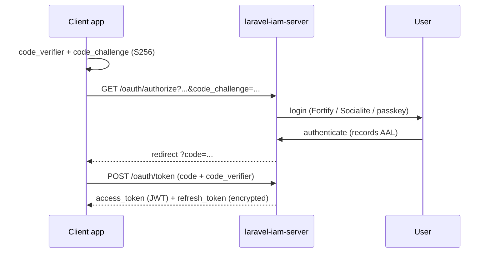

# OAuth2 clients & PKCE

The server is a full OAuth2 identity provider built on
[`league/oauth2-server`](https://oauth2.thephpleague.com/) — **not** Passport. This guide covers the grant
flows it issues. OAuth code lives in `src/Domain/OAuth/`.

## Grants

Enabled in `config/iam.php` under `oauth.grants`:

| Grant | Use | Default |
|---|---|---|
| `authorization_code` (+ PKCE) | Interactive apps & SPAs | on |
| `client_credentials` | Service-to-service | on |
| `refresh_token` | Long-lived sessions, encrypted & rotated | on |

PKCE (`S256`) is **required for public clients** (`oauth.require_pkce`). Auth-code TTL defaults to 10
minutes (`oauth.auth_code_ttl`), and the OAuth endpoints are rate-limited (`oauth.rate_limit`, default
60/min).

## Authorization-code + PKCE flow


```mermaid
sequenceDiagram
    participant App as Client app
    participant IdP as laravel-iam-server
    participant User
    App->>App: code_verifier + code_challenge (S256)
    App->>IdP: GET /oauth/authorize?...&code_challenge=...
    IdP->>User: login (Fortify / Socialite / passkey)
    User->>IdP: authenticate (records AAL)
    IdP-->>App: redirect ?code=...
    App->>IdP: POST /oauth/token (code + code_verifier)
    IdP-->>App: access_token (JWT) + refresh_token (encrypted)
```

::: steps
1. **Generate the PKCE pair** in the client (`code_verifier`, then `code_challenge = S256(verifier)`).
2. **Redirect to authorize**
   ```
   GET https://iam.example.com/oauth/authorize
       ?response_type=code&client_id=warehouse-spa
       &redirect_uri=https://app.example.com/callback
       &scope=openid%20profile&code_challenge=...&code_challenge_method=S256
   ```
3. **Exchange the code**
   ```bash
   curl -X POST https://iam.example.com/oauth/token \
     -d grant_type=authorization_code -d client_id=warehouse-spa \
     -d code=$CODE -d code_verifier=$VERIFIER \
     -d redirect_uri=https://app.example.com/callback
   ```
:::

## Client-credentials (services)

For machine-to-machine callers with no user:

```bash
curl -X POST https://iam.example.com/oauth/token \
  -d grant_type=client_credentials \
  -d client_id=$CLIENT_ID -d client_secret=$CLIENT_SECRET -d scope=warehouse.read
```

`ClientAuthenticator` validates the client; the issued access token is a JWT your services verify against
JWKS.

## Refresh-token rotation

Refresh tokens are **encrypted at rest** (`RefreshTokenCrypto`) and rotated on use:

```bash
curl -X POST https://iam.example.com/oauth/token \
  -d grant_type=refresh_token -d refresh_token=$REFRESH -d client_id=warehouse-spa
# → new access_token + new refresh_token; the old refresh token is invalidated
```

## Client-secret rotation & expiry

A client secret is issued **once** at manifest apply and stored **hashed**. Rotate it — on a leak, on a
schedule, or before its expiry — **without downtime**: the previous secret stays valid for a **grace
window** so the app can roll over.

```bash
# Rotate → a NEW secret is returned once; the OLD one keeps working until the grace ends.
curl -X POST https://iam.example.com/api/iam/v1/applications/warehouse/rotate-secret \
  -H "Idempotency-Key: $(uuidgen)"
# → { "data": { "client_id": "cli_warehouse", "client_secret": "NEW-…-ONCE", "grace_until": "…" } }
```

**Rollover procedure (zero downtime):** rotate → deploy the new secret to the app during the grace window
(`iam.oauth.client_secret_grace`, default **72h**) → after the grace the old secret stops validating.
`validateClient` accepts **either** secret while the grace is active.

**Scheduled expiry & alerts.** Set `IAM_OAUTH_CLIENT_SECRET_TTL` (seconds) to give new secrets a lifetime;
`GET /api/iam/v1/applications/{app}/client` reports `secret_status` (`ok` · `expiring` · `expired` ·
`revoked`) and `secret_expires_at`, which the console surfaces as rotation alerts. Expiry is **soft** (it
drives alerts; the secret keeps working so an un-rotated app never breaks unexpectedly) — the **grace** end
is the only hard cut-off, and only for the *previous* secret.

**Revoke** a client immediately (kills all its auth):

```bash
curl -X POST https://iam.example.com/api/iam/v1/applications/warehouse/revoke-client -H "Idempotency-Key: $(uuidgen)"
```

Rotation/revoke require `iam:clients.manage`; reading credential status requires `iam:applications.read`.

### Automatic rotation (no admin, no downtime)

Opt a client into `auto_rotate` (with a `rotate_interval_days`) and the scheduler rotates it for you — no
manual step, no one tracking expiries. Because no human receives the new secret, the server keeps it
**encrypted at rest** so the app can **self-fetch** it during the grace window:

1. Schedule the command (host): `$schedule->command('iam:rotate-due-secrets')->daily();` — it rotates due
   clients and clears pending ciphertexts whose grace has lapsed.
2. On rotation, the new secret is stored encrypted; the previous secret stays valid for the grace.
3. The app fetches the new secret with its **still-valid current secret** and hot-swaps:

```bash
curl -X POST https://iam.example.com/oauth/client-secret \
  -u "cli_warehouse:$CURRENT_SECRET"
# → { "rotated": true, "client_secret": "NEW-SECRET", "grace_until": "…" }   (or { "rotated": false })
```

Only the legitimate client — the one holding a valid secret — can retrieve the rotated one (`validateClient`
is the gate; there is no user/PDP auth here, it's client authentication). `laravel-iam-client` does this
fetch-and-swap automatically. Disable the endpoint with `IAM_OAUTH_CLIENT_SELFFETCH=false`. For a shared
secret you never want to rotate at all, use asymmetric `private_key_jwt` instead (roadmap).

## Token signing & JWKS

Access tokens are signed with **ES256** using rotating signing keys (`iam_signing_keys`). Consumers fetch
the public keys from the JWKS endpoint and verify offline — no introspection round-trip required for the
common path. See [OAuth2 & OIDC architecture](/architecture/oauth-oidc).

::: callout danger "Licensing invariant" icon:scale
OAuth must remain `league/oauth2-server`, and the OIDC layer uses the **MIT** steverhoades base. AGPL code
(limosa-io) is forbidden in this codebase — a hard ecosystem rule.
:::

::: callout warning "Public clients must use PKCE" icon:shield
A SPA or mobile client cannot keep a secret. With `oauth.require_pkce` on (the default) the server rejects a
public-client auth-code exchange without a valid `code_verifier`. Never embed a client secret in a public
client.
:::

## Next

- [OIDC login](/guides/oidc-login) — the identity layer on top of these tokens.
- [Sessions & step-up](/guides/sessions-and-step-up) — revocable sessions and AAL.
- [OAuth2 & OIDC architecture](/architecture/oauth-oidc) — keys, JWKS, ES256 in depth.
