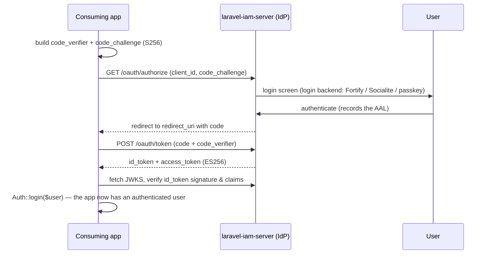

# OIDC login

On top of OAuth2, the server exposes an **OpenID Connect** layer (`src/Domain/OAuth/Oidc/`) so apps get a
standard identity protocol: discovery, JWKS, and signed `id_token`s. The base is **MIT** (steverhoades) —
never AGPL.

## Motivation

OAuth2 issues *access* tokens (authorization). OIDC adds an *identity* token (`id_token`) and a standard
discovery document, so any OIDC-compliant client can log in against your server without bespoke wiring.

## Discovery & JWKS

The provider publishes the standard endpoints at the application root:

```bash
curl https://iam.example.com/.well-known/openid-configuration
curl https://iam.example.com/.well-known/jwks.json
```

The discovery document advertises the authorization, token and JWKS URLs; clients fetch JWKS to verify
`id_token` and access-token signatures (ES256) offline.

## The login flow

Login is an **authentication** flow your *consuming app* runs against the server as an IdP. Be precise about
the division of labour: `laravel-iam-client` is **not** part of the login handshake — it handles
*authorization* (PDP decisions) once a user is already logged in. The app performs the standard
authorization-code + PKCE flow (with any OIDC/OAuth2 library, e.g. Laravel Socialite pointed at the discovery
document); the server's **login backend** (Fortify / Socialite / passkeys — `suggest` dependencies)
authenticates the user; the app then verifies the returned `id_token` and logs the user in locally.



You don't hand-roll the crypto — use an OIDC/OAuth2 client library that consumes the discovery document. Once
the user is authenticated, [`laravel-iam-client`](https://doc.laravel-iam-client.padosoft.com) takes over for
**authorization**: `iam.auth` sees the authenticated user and `iam.can` checks their grants against the PDP.
The end-to-end [tutorial](/tutorial/07-login-oidc) walks the whole flow step by step.

## Federated identities

A user can authenticate through an upstream provider; the link is stored in `iam_federated_identities`
(`src/Domain/Identity/Federation/`). Configure social/federated login by adding
[Socialite](https://laravel.com/docs/socialite) (a `suggest` dependency) as the backend — the IdP records
which provider proved the identity and at what assurance level.

## What's in the id_token

The `id_token` carries standard OIDC claims plus the subject and the assurance level reached at
authentication, which the [PDP can require step-up against](/concepts/assurance-aal). It is signed with the
same rotating ES256 keys as access tokens.

::: callout warning "Verify, don't trust" icon:shield
Always verify the `id_token` signature against JWKS and check `iss`, `aud` and `exp` before trusting any
claim. Your OIDC client library must do this at login time. If you integrate a non-PHP app, the SDKs
([Node](https://doc.laravel-iam-node.padosoft.com), [Rust](https://doc.laravel-iam-rust.padosoft.com))
verify tokens fail-closed for you.
:::

## Next

- [Sessions & step-up](/guides/sessions-and-step-up) — revocable server-side sessions and AAL.
- [OAuth2 clients & PKCE](/guides/oauth-clients) — the grant flows beneath OIDC.
- [Assurance levels](/concepts/assurance-aal) — how authentication strength feeds decisions.
