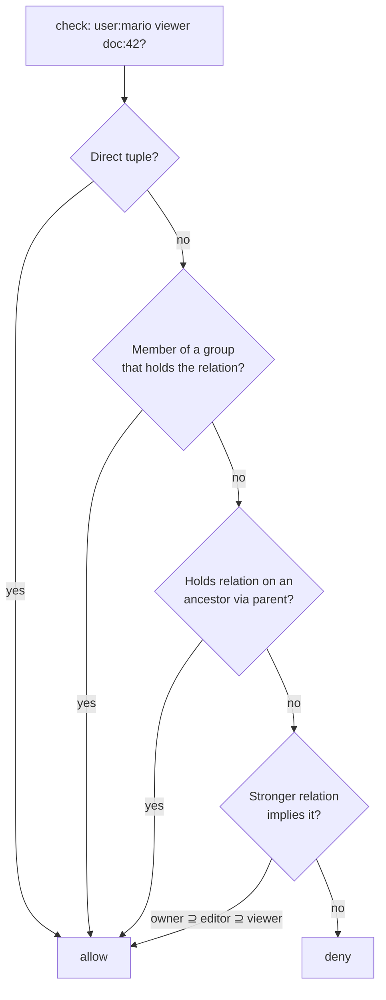

# ReBAC relationships

Beyond roles (RBAC) and attributes (ABAC), the PDP answers **per-resource** questions: *can this subject act
on **this** object because of a relationship?* This is relationship-based access control (ReBAC), in the
style of Google Zanzibar — implemented natively in SQL since **M16 (v1.2.0)**.

## Motivation

Roles say "operators can edit stock". They cannot say "Mario can edit **this** document because he owns
it". Per-resource sharing — owners, editors, viewers, parent folders, team membership — is a graph, not a
role table. ReBAC stores those edges as tuples and answers reachability.

## Tuples

A relationship is a tuple `(subject, relation, object)` stored in `iam_relations` — e.g.
`(user:mario, owner, doc:42)`. Write and revoke them through `RelationWriter` (idempotent and audited):

```php
use Padosoft\Iam\Contracts\Support\SubjectRef;
use Padosoft\Iam\Contracts\Support\ResourceRef;

app(RelationWriter::class)->grant(new SubjectRef('user', 'mario'), 'owner', new ResourceRef('doc', '42'));
app(RelationWriter::class)->revoke(new SubjectRef('user', 'mario'), 'owner', new ResourceRef('doc', '42'));
```

Or over HTTP:

```bash
curl -X POST   https://iam.example.com/api/iam/v1/relations -H "Authorization: Bearer $ADMIN_TOKEN" \
  -d '{"subject":"user:mario","relation":"owner","object":"doc:42"}'
curl -X DELETE https://iam.example.com/api/iam/v1/relations -H "Authorization: Bearer $ADMIN_TOKEN" \
  -d '{"subject":"user:mario","relation":"owner","object":"doc:42"}'
```

## How traversal works

The native resolver computes reachability in the relationship graph — **bounded** and **fail-closed**:



| Path | Meaning |
|---|---|
| **Direct** | The tuple exists. |
| **Group nesting** | The subject is a `member` of a group that holds the relation (transitive). |
| **Resource hierarchy** | The subject holds the relation on an ancestor reached via `parent` (propagates down). |
| **Implication** | A stronger relation satisfies a weaker check (default `owner ⊇ editor ⊇ viewer`). |

Traversal is **hard-capped** (depth + cycle guard). Exceeding the bound is a **deny**, surfaced in the
explanation — never a silent allow.

## Two ways relationships enter a decision

- **Direct relation check** — the query carries `relation` + `object`; the PDP returns allow iff the
  relation holds:
  ```php
  $decision = app(AuthorizationEngine::class)->check([
      'subject'  => ['type' => 'user', 'id' => 'mario'],
      'relation' => 'viewer',                 // owner satisfies viewer via implication
      'resource' => ['type' => 'doc', 'id' => '42'],
  ]);
  // $decision['allowed'] === true
  ```
- **Permission→relation binding** — a permission declares a required `relation` in its manifest; a normal
  permission check on a resource then also consults the graph. Same engine, same explanation, same audit —
  and **deny-overrides still wins**: an explicit deny is never overridden by a relational permit.

## Reverse-index queries

ReBAC also answers "who?" and "what?" — exposed on the `AuthorizationEngine` interface and the Admin API:

```php
// who can read this document?
$subjects  = $engine->listSubjects('viewer', 'doc', '42');
// what can this user edit?
$resources = $engine->listResources(new SubjectRef('user', 'mario'), 'editor');
```

```bash
POST /api/iam/v1/decisions/list-subjects     # { "object": "doc:42", "relation": "viewer" }
POST /api/iam/v1/decisions/list-resources    # { "subject": "user:mario", "relation": "editor" }
```

## Groups feed the graph

Admin API **groups** (M17) write the ReBAC `member` tuple, so nesting a user in a group — or a group in a
group — is visible to the resolver automatically:

```bash
POST /api/iam/v1/groups/{group}/members     # adds (user, member, group:...) → traversal sees it
```

::: collapsible "ADR — native SQL ReBAC now, external Zanzibar backend later"
**Problem.** Pure-Zanzibar engines (OpenFGA / SpiceDB) scale to billions of tuples but add an external
dependency most deployments don't need on day one.

**Decision.** Ship a native SQL resolver with bounded traversal behind the `AuthorizationEngine` interface,
which already exposes `listSubjects` / `listResources`. The external backend is a v2 swap.

**Consequences.** Self-contained for the common case, fail-closed by bounding depth; a future external
backend slots in without touching the PDP or the manifest contract.
:::

::: callout warning "Bounded by design" icon:gauge
Deep or cyclic graphs hit the depth/cycle cap and **deny**, with the reason in the explanation. If you model
very deep hierarchies, raise the bound deliberately and test the denial path — do not assume unbounded
reachability.
:::

## Next

- [Authorization models](/concepts/authorization-models) — where ReBAC sits among RBAC and ABAC.
- [PDP decision pipeline](/architecture/pdp-pipeline) — how a check flows end to end.
- [Data model](/architecture/data-model) — the `iam_relations` and groups tables.
