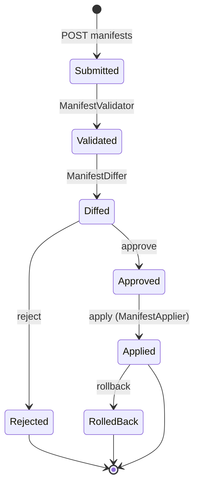

# Register an application

The core hardcodes **no** permissions. Every consuming app *declares* what it needs in a **manifest**, and
the **Application Registry** turns that declaration into governed policy. This is the package's central
design decision — and its moat.

## Motivation

If the server shipped a fixed permission list, every new app would need a core release. Instead, apps own
their permission vocabulary and submit it as data. The registry **validates, diffs, approves, applies and
can roll back** — so policy changes are reviewable and reversible, and the core stays generic.

## The manifest

A manifest declares an app's permissions, roles, scopes and ABAC conditions. Slugs are immutable and
namespaced `app_key:permission`:

```jsonc
{
  "app_key": "warehouse",
  "permissions": [
    { "key": "warehouse:stock.read",   "label": "Read stock" },
    { "key": "warehouse:stock.adjust", "label": "Adjust stock",
      "condition": { "attr": "amount", "op": "<=", "value": 1000 } },
    { "key": "warehouse:stock.write",  "label": "Write stock", "relation": "editor" }
  ],
  "roles": [
    { "key": "warehouse:operator",  "permissions": ["warehouse:stock.read", "warehouse:stock.adjust"] },
    { "key": "warehouse:supervisor", "permissions": ["warehouse:stock.write"], "inherits": ["warehouse:operator"] }
  ]
}
```

- **`condition`** attaches an [ABAC](/concepts/authorization-models#abac) rule evaluated against request
  `context`.
- **`relation`** binds a permission to a [ReBAC](/guides/rebac-relationships) relation, so the check also
  consults the relationship graph.
- **`inherits`** composes roles.

## The lifecycle



::: steps
1. **Submit**
   ```bash
   curl -X POST https://iam.example.com/api/iam/v1/applications/warehouse/manifests \
     -H "Authorization: Bearer $ADMIN_TOKEN" -H "Content-Type: application/json" \
     -d @warehouse-manifest.json
   ```
   `ManifestValidator` rejects malformed slugs, unknown operators and dangling role references up front.

2. **Diff** — see exactly what would change before committing:
   ```bash
   curl https://iam.example.com/api/iam/v1/manifests/{id}/diff -H "Authorization: Bearer $ADMIN_TOKEN"
   ```
   `ManifestDiffer` compares the submission against the currently-applied manifest: added/removed
   permissions, changed conditions, role deltas.

3. **Approve** (or reject)
   ```bash
   curl -X POST https://iam.example.com/api/iam/v1/manifests/{id}/approve -H "Authorization: Bearer $ADMIN_TOKEN"
   ```

4. **Apply**
   ```bash
   curl -X POST https://iam.example.com/api/iam/v1/manifests/{id}/apply \
     -H "Authorization: Bearer $ADMIN_TOKEN" -H "Idempotency-Key: $(uuidgen)"
   ```
   `ManifestApplier` writes the new catalog state atomically and records an audit entry.

5. **Rollback** if needed
   ```bash
   curl -X POST https://iam.example.com/api/iam/v1/manifests/{id}/rollback -H "Authorization: Bearer $ADMIN_TOKEN"
   ```
:::

## From the CLI

The same operations are available offline for CI pipelines:

```bash
php artisan iam:manifest:validate warehouse-manifest.json
php artisan iam:manifest:apply    warehouse-manifest.json --approve --by=ci-bot
php artisan iam:manifest:rollback warehouse
```

See the [CLI reference](/operations/cli).

::: collapsible "ADR — why declared manifests instead of a core permission table"
**Problem.** A hardcoded permission catalog couples every app's vocabulary to the server's release cycle and
makes the core a bottleneck.

**Decision.** Apps declare permissions/roles/scopes/conditions as a manifest; the registry validates, diffs,
approves, applies and can roll back. The core stores, never authors, policy.

**Consequences.** Apps evolve independently and safely; every policy change is reviewable (diff) and
reversible (rollback) and audited. The cost is a submission workflow instead of a migration — which is
exactly the governance you want for authorization.
:::

::: callout warning "Slugs are forever" icon:lock
A permission slug is an immutable identity (`app_key:permission`). Renaming means *adding* a new permission
and migrating grants — the differ will show a remove + add, not a rename. Plan your namespace before you
ship it.
:::

## Next

- [Manifests & declared policy](/concepts/manifests) — the concept in depth.
- [Ask the PDP](/guides/ask-the-pdp) — evaluate the permissions you just declared.
- [Admin API reference](/reference/admin-api) — the full applications/manifests surface.
