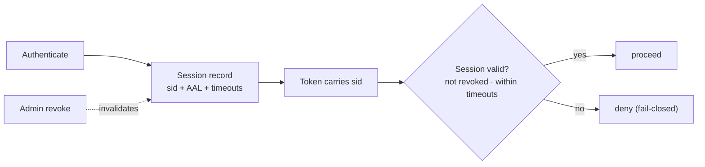
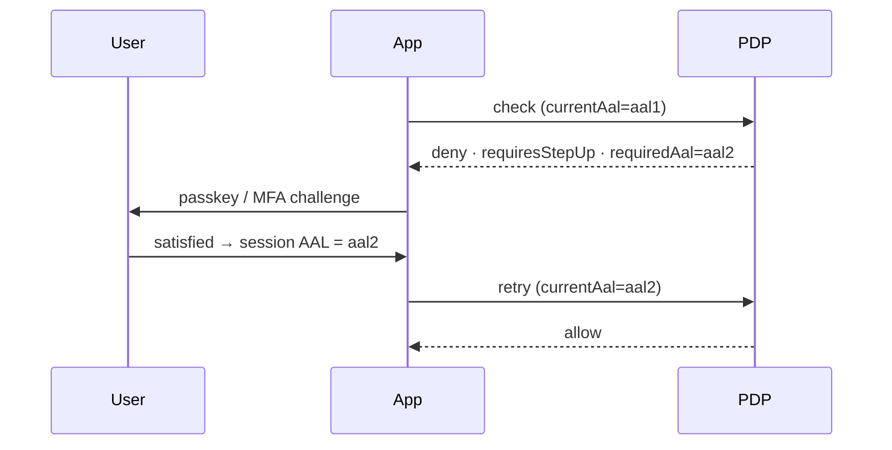

# Sessions & step-up

The IdP issues tokens, but the *session* behind them is **server-side and revocable** — so an admin can cut
off access immediately, and the PDP can demand a stronger proof of identity before a sensitive action.
Session code lives in `src/Domain/Identity/Session/`; assurance in `src/Domain/Identity/Assurance/`.

## Why server-side sessions

A bare JWT is valid until it expires — you cannot revoke it. Binding tokens to a server-side session record
(via a `sid`) means revocation is immediate and auditable, idle/absolute timeouts are enforced centrally,
and every session check is **fail-closed**: if the session can't be confirmed valid, access is denied.



## Revoking sessions

Through the Admin API:

```bash
# revoke one session
curl -X POST https://iam.example.com/api/iam/v1/sessions/{session}/revoke -H "Authorization: Bearer $ADMIN_TOKEN"

# revoke every session for a user
curl -X POST https://iam.example.com/api/iam/v1/users/{user}/sessions/revoke-all -H "Authorization: Bearer $ADMIN_TOKEN"

# inspect
curl https://iam.example.com/api/iam/v1/sessions          -H "Authorization: Bearer $ADMIN_TOKEN"
curl https://iam.example.com/api/iam/v1/sessions/{session} -H "Authorization: Bearer $ADMIN_TOKEN"
```

Every revocation is recorded in the [audit chain](/concepts/tamper-evident-audit).

## Step-up to AAL2

A permission can require a higher [assurance level](/concepts/assurance-aal). When the session's
`currentAal` is below what a policy needs, the PDP returns:

```php
$decision->allowed;        // false
$decision->requiresStepUp; // true
$decision->requiredAal;    // 'aal2'
```

The caller sends the user through a step-up challenge (passkey / MFA), the session's AAL is elevated, and
the action is retried:



Step-up challenges are tracked in `iam_step_up_challenges`; passkeys (the `laravel/passkeys` suggest
dependency) satisfy AAL2.

::: callout warning "Step-up is not a one-time flag" icon:timer
Elevated assurance is bound to the session and subject to the same timeouts. A long-idle session can drop
back below AAL2, so design sensitive flows to re-check the decision rather than caching "this user stepped
up once".
:::

## Next

- [Assurance levels (AAL)](/concepts/assurance-aal) — NIST 800-63B, formally.
- [Ask the PDP](/guides/ask-the-pdp) — the `requiresStepUp` path in context.
- [OIDC login](/guides/oidc-login) — where the initial AAL is recorded.
