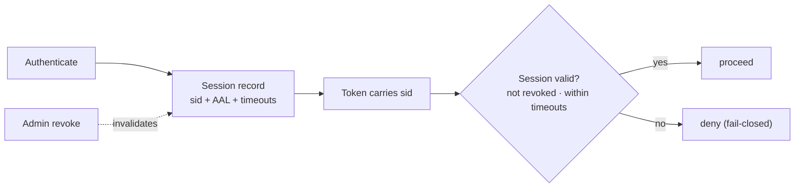
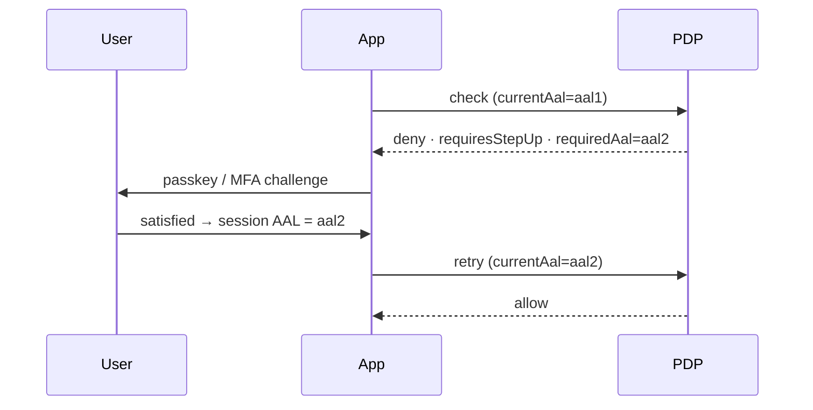

# Sessions & step-up

The IdP issues tokens, but the *session* behind them is **server-side and revocable** — so an admin can cut
off access immediately, and the PDP can demand a stronger proof of identity before a sensitive action.
Session code lives in `src/Domain/Identity/Session/`; assurance in `src/Domain/Identity/Assurance/`.

## Why server-side sessions

A bare JWT is valid until it expires — you cannot revoke it. Binding tokens to a server-side session record
(via a `sid`) means revocation is immediate and auditable, idle/absolute timeouts are enforced centrally,
and every session check is **fail-closed**: if the session can't be confirmed valid, access is denied.


```mermaid
flowchart LR
    LOGIN["Authenticate"] --> SESS["Session record<br/>sid + AAL + timeouts"]
    SESS --> TOK["Token carries sid"]
    TOK --> CHK{Session valid?<br/>not revoked · within timeouts}
    CHK -->|yes| OK["proceed"]
    CHK -->|no| DENY["deny (fail-closed)"]
    ADMIN["Admin revoke"] -. invalidates .-> SESS
```

## Revoking sessions

Through the Admin API:

```bash
# revoke one session
curl -X POST https://iam.example.com/api/iam/v1/sessions/{session}/revoke -H "Authorization: Bearer $ADMIN_TOKEN"

# revoke every session for a user
curl -X POST https://iam.example.com/api/iam/v1/users/{user}/sessions/revoke-all -H "Authorization: Bearer $ADMIN_TOKEN"

# inspect
curl https://iam.example.com/api/iam/v1/sessions          -H "Authorization: Bearer $ADMIN_TOKEN"
curl https://iam.example.com/api/iam/v1/sessions/{session} -H "Authorization: Bearer $ADMIN_TOKEN"
```

Every revocation is recorded in the [audit chain](/concepts/tamper-evident-audit).

## Step-up to AAL2

A permission can require a higher [assurance level](/concepts/assurance-aal). When the session's
`currentAal` is below what a policy needs, the PDP returns:

```php
$decision->allowed;        // false
$decision->requiresStepUp; // true
$decision->requiredAal;    // 'aal2'
```

The caller sends the user through a step-up challenge (passkey / MFA), the session's AAL is elevated, and
the action is retried:


```mermaid
sequenceDiagram
    participant U as User
    participant App
    participant PDP
    App->>PDP: check (currentAal=aal1)
    PDP-->>App: deny · requiresStepUp · requiredAal=aal2
    App->>U: passkey / MFA challenge
    U->>App: satisfied → session AAL = aal2
    App->>PDP: retry (currentAal=aal2)
    PDP-->>App: allow
```

Step-up challenges are tracked in `iam_step_up_challenges`; passkeys (the `laravel/passkeys` suggest
dependency) satisfy AAL2.

::: callout warning "Step-up is not a one-time flag" icon:timer
Elevated assurance is bound to the session and subject to the same timeouts. A long-idle session can drop
back below AAL2, so design sensitive flows to re-check the decision rather than caching "this user stepped
up once".
:::

## Two kinds of 2FA — don't confuse them

- **Per-action step-up (this page, the PDP):** a *permission* can demand AAL2 via `requires_step_up`; the PDP
  returns `requiresStepUp` until the caller has stepped up. This protects *sensitive actions* in any app,
  decided at authorization time.
- **Mandatory console login 2FA (the host console):** a security posture for the *admin console operators*.
  The deployable host ([`laravel-iam-console`](https://github.com/padosoft/laravel-iam-console)) offers
  `IAM_CONSOLE_2FA=true` (operators may enrol TOTP) and `IAM_CONSOLE_2FA_REQUIRED=true` (every operator is
  **forced** to enrol before using the console). That's login-time enforcement for the panel, separate from
  the PDP step-up above.

## Session lifecycle, timeouts & retention

A session is **active** while it is not revoked, not past its **idle** window, and not past its **absolute**
ceiling. The timeouts are configurable (`iam.authentication.session.*`), env-driven on the host:

| Setting | Env | Default | Meaning |
|---|---|---|---|
| idle timeout | `IAM_SESSION_IDLE_TIMEOUT` | `1800` (30m) | Re-auth after this much inactivity. |
| absolute timeout | `IAM_SESSION_ABSOLUTE_TIMEOUT` | `43200` (12h) | Hard ceiling — **never extended**. |
| step-up window | `IAM_SESSION_STEPUP_WINDOW` | `300` (5m) | How long a step-up stays satisfied. |
| concurrent limit | `IAM_SESSION_CONCURRENT_LIMIT` | unlimited | Max concurrent sessions per subject. |
| retention | `IAM_SESSION_RETENTION_DAYS` | `90` | Days before ended/expired rows are pruned. |

**States you'll see** (e.g. in the console Sessions grid): `active` · `idle` (past the idle window) ·
`expired` (past the absolute ceiling) · `revoked` (with a reason: `logout`, `idle`, `absolute_expired`,
`device_removed`, …).

### Keeping the table bounded — `iam:prune-sessions`

Expiry is evaluated on each request, so a session that idles out is rejected the moment its owner returns —
but a session no one comes back to would otherwise sit in `iam_sessions` forever with `revoked_at = null`.
Schedule the prune command **daily**:

```php
// routes/console.php (host)
Schedule::command('iam:prune-sessions')->daily();
```

It runs two steps: (1) an **expiry sweep** — marks idle- and absolute-expired sessions as revoked with the
reason (`idle` / `absolute_expired`), so the store reflects reality; (2) **retention** — hard-deletes rows
revoked longer than `IAM_SESSION_RETENTION_DAYS`. Override the window per run with `--days=`.

## Next

- [Assurance levels (AAL)](/concepts/assurance-aal) — NIST 800-63B, formally.
- [Ask the PDP](/guides/ask-the-pdp) — the `requiresStepUp` path in context.
- [OIDC login](/guides/oidc-login) — where the initial AAL is recorded.
- [CLI reference](/operations/cli) — `iam:prune-sessions` and the other commands.
