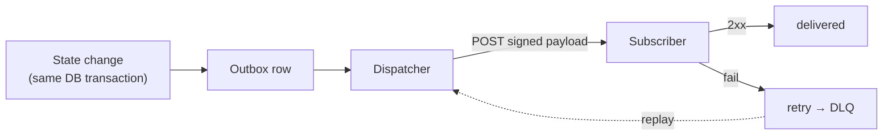

# Webhooks & events

The server emits domain events (decisions, manifest changes, grants, revocations, governance actions) and
delivers them to subscribers **reliably**. Code lives in `src/Domain/Audit/Webhooks/` and
`src/Domain/Audit/Outbox/`.

## Motivation

Fire-and-forget HTTP from inside a transaction loses events on a crash and can deliver events for a
rolled-back transaction. The **transactional outbox** pattern fixes both: the event is written to an outbox
table in the *same* transaction as the state change, then delivered asynchronously — at-least-once, durable
across restarts.



## Subscriptions

Register a webhook with a target URL and a secret (the secret is **write-only** — stored encrypted, never
returned):

```bash
curl -X POST https://iam.example.com/api/iam/v1/webhooks \
  -H "Authorization: Bearer $ADMIN_TOKEN" \
  -d '{"url":"https://app.example.com/iam/webhook","events":["decision.denied","manifest.applied"],"secret":"whsec_..."}'

curl https://iam.example.com/api/iam/v1/webhooks                       -H "Authorization: Bearer $ADMIN_TOKEN"
curl -X POST https://iam.example.com/api/iam/v1/webhooks/{subscription}/test -H "Authorization: Bearer $ADMIN_TOKEN"
```

Subscribers verify the signature using the shared secret — the same model the
[`laravel-iam-client`](https://doc.laravel-iam-client.padosoft.com) webhook receiver implements.

## Inspecting & replaying deliveries

Every delivery attempt is recorded. Failed deliveries land in a dead-letter queue you can replay:

```bash
# delivery history for a subscription
curl https://iam.example.com/api/iam/v1/webhooks/{subscription}/deliveries -H "Authorization: Bearer $ADMIN_TOKEN"

# replay a failed delivery from the DLQ
curl -X POST https://iam.example.com/api/iam/v1/webhooks/deliveries/{delivery}/replay -H "Authorization: Bearer $ADMIN_TOKEN"
```

::: callout tip "At-least-once means idempotent receivers" icon:repeat
A reliable outbox can deliver the same event more than once (e.g. a 2xx that arrived after a timeout).
Receivers must be **idempotent** — key on the event id and ignore duplicates. The client's webhook receiver
already does this.
:::

## What gets emitted

The same state changes that enter the [audit chain](/concepts/tamper-evident-audit) can drive webhooks:
decisions (notably denials), manifest approve/apply/rollback, grant changes, session revocations,
access-review certifications and access-request approvals. Audit is the source of truth; webhooks are a
delivery channel on top of it.

::: callout warning "Secrets are write-only" icon:eye-off
Webhook (and federated-provider, and directory-source) secrets are stored encrypted and **never returned**
by the API. If you lose one, rotate it — there is no read-back. This is deliberate: a leaked Admin API
response must not leak signing material.
:::

## Next

- [Tamper-evident audit](/concepts/tamper-evident-audit) — the event source of truth.
- [Audit & compliance](/best-practices/audit-and-compliance) — SIEM export alongside webhooks.
- [Admin API reference](/reference/admin-api) — the full webhooks surface.
