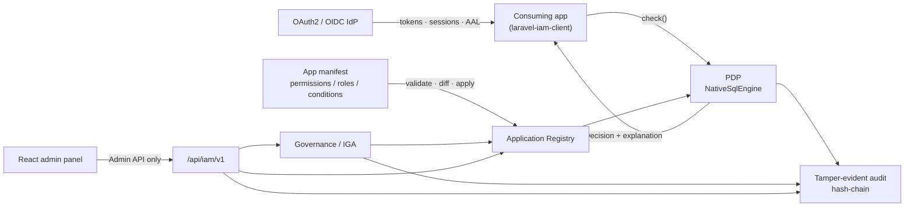

# laravel-iam-server

> **`padosoft/laravel-iam-server` gives every app in your estate one place to log in, one place to decide who can do what, and one place to prove it later — running inside infrastructure you own, as a composer package, not a metered SaaS.**
> An OAuth2 / OIDC identity provider, a deterministic **RBAC + ABAC + ReBAC** policy decision point, a tamper-evident hash-chained audit log, an IGA governance suite, and a React admin panel — all driven through a single Admin API.

::: callout info "New here? Read this page top to bottom" icon:compass
In a few minutes you'll know exactly what this package is, the problem it solves, why it beats renting an
IdP or hand-rolling permissions, and where to click next. Every other page goes deeper — this one gives
you the whole picture.
:::

---

## What it is — in one minute

Most teams end up with authorization scattered across every app: a `spatie/permission` table here, a pile
of `Gate::define()` closures there, hand-rolled OAuth somewhere else, and no single answer to *"who can do
this, and who granted them that?"*. Renting an IdP (Auth0, Okta, Entra) fixes **login** but leaves
**authorization** — and your audit trail — in someone else's cloud, metered per monthly active user.

`laravel-iam-server` is the **control plane you host yourself**. It is at once:

- an **identity provider** — OAuth2 on [`league/oauth2-server`](https://oauth2.thephpleague.com/) plus an
  OIDC layer, with server-side, revocable sessions;
- a **policy decision point (PDP)** — one deterministic engine that answers *"can subject X do permission Y
  on resource Z?"* with **RBAC + ABAC + ReBAC**, **deny-overrides**, **fail-closed**, and a citable
  explanation;
- a **tamper-evident audit log** — every mutation hash-chained and verifiable, exportable to your SIEM;
- an **identity governance (IGA)** suite — access reviews, access requests/approvals, least-privilege
  recommendations and separation-of-duties;
- an **admin panel** — a React console driven entirely through the Admin API (no UI ever touches the DB).

Apps stop owning authorization logic. They **declare** their permissions/roles/scopes in a *manifest*, and
ask the PDP. You get one place to see and prove every access decision.

> **In one line:** *the shortest path from "every app reinvents auth" to "one IdP, one decision point, one
> audit log — self-hosted and provable".*

---

## The problem it solves

| Without laravel-iam-server | With laravel-iam-server |
|---|---|
| Every app grows its own roles table and its own copy of "who is an admin". | Apps **declare** permissions in a manifest; one PDP decides for all of them. |
| Login is centralized (an external IdP) but *decisions* are not — nobody can answer "who can adjust stock?". | One `check()` entrypoint, deterministic and explainable, is the only allow/deny authority. |
| Authorization logic and your audit trail live in a vendor's cloud, metered per MAU. | You own the control plane: a composer package on your own database. |
| "Who approved this access?" means reading code in five repositories. | A hash-chained, verifiable audit log records every grant, decision and approval. |
| An error in an auth check quietly *allows* an action. | **Fail-closed**: any error, malformed query or missing data resolves to **deny**. |
| Passing an access audit means screenshots and spreadsheets. | Access-review campaigns, SoD and least-privilege produce diffable, signed evidence. |

---

## Who it's for

::: grids
  ::: grid
    ::: card "Platform teams" icon:server
    You run many Laravel apps and want one IdP and one authorization service on infrastructure you control,
    instead of a per-MAU SaaS bill.
    :::
  :::
  ::: grid
    ::: card "Security & compliance" icon:shield
    You need verifiable audit, access reviews, separation-of-duties and least-privilege evidence — the
    artifacts an auditor actually asks for.
    :::
  :::
  ::: grid
    ::: card "App developers" icon:code
    You're tired of re-implementing roles in every service. Declare a manifest, install
    [`laravel-iam-client`](https://github.com/padosoft/laravel-iam-client), and protect routes with
    `iam.can`.
    :::
  :::
  ::: grid
    ::: card "Regulated operators" icon:scale
    You must prove tamper-evidence, PII crypto-shredding under GDPR, and step-up assurance on sensitive
    actions — as auditable, exportable records.
    :::
  :::
:::

---

## Why it's different — the moats

::: grids
  ::: grid
    ::: card "One deterministic PDP" icon:scale
    `NativeSqlEngine` evaluates RBAC + ABAC + ReBAC in **one pass**, deny-overrides, fail-closed. Every
    `Decision` carries a `decisionId`, the matched policies and a human-readable `explanation` you can cite
    in audit.
    :::
  :::
  ::: grid
    ::: card "Application Registry + manifests" icon:boxes
    Apps submit a manifest of their permissions/roles/scopes/conditions; it is **validated, diffed,
    approved, applied and rollback-able**. The core hardcodes nothing — this is the real moat.
    :::
  :::
  ::: grid
    ::: card "Full OAuth2 + OIDC IdP" icon:key-round
    Authorization-code/PKCE, client-credentials, refresh (encrypted), JWKS, an OIDC layer on an **MIT**
    base (never AGPL). Bring your own login backend — Fortify, Socialite, passkeys.
    :::
  :::
  ::: grid
    ::: card "Tamper-evident audit" icon:link
    Hash-chained events (`AuditChainAppender` / `AuditChainVerifier`), SIEM export, a transactional outbox
    for webhooks, and GDPR crypto-shredding / legal-hold for PII.
    :::
  :::
  ::: grid
    ::: card "Governance built in" icon:clipboard-check
    Access-review campaigns, multi-step access-request approvals, least-privilege recommendations and SoD —
    each gated per layer / app / role / user via a feature scope.
    :::
  :::
  ::: grid
    ::: card "Admin API, never the DB" icon:terminal
    Every admin route is documented in `resources/openapi.yaml` (enforced by a test), protected by the
    `iam.can` middleware, idempotent on writes. The panel is just another client.
    :::
  :::
:::

---

## How it fits together

A consuming app declares a manifest and asks the PDP; the PDP evaluates declared policy and emits a decision
that is logged into the hash-chained audit. Governance and the admin panel observe and steer the same data.



---

## Start in 60 seconds

::: steps
1. **Install the package**
   ```bash
   composer require padosoft/laravel-iam-server
   php artisan vendor:publish --tag="laravel-iam-server-config"
   php artisan migrate
   ```
   The service provider auto-registers the Admin API (`/api/iam/v1`), OAuth and OIDC routes, and the
   `iam.can` / `iam.admin_auth` / `iam.idempotency` middleware.

2. **Register an application and its manifest**
   ```jsonc
   {
     "app_key": "warehouse",
     "permissions": [
       { "key": "warehouse:stock.read",   "label": "Read stock" },
       { "key": "warehouse:stock.adjust", "label": "Adjust stock",
         "condition": { "attr": "amount", "op": "<=", "value": 1000 } }
     ],
     "roles": [
       { "key": "warehouse:operator", "permissions": ["warehouse:stock.read", "warehouse:stock.adjust"] }
     ]
   }
   ```
   Submit it (`POST /applications/{app}/manifests`), then **approve** and **apply** — validated and diffed
   first.

3. **Ask the PDP**
   ```php
   $decision = app(\Padosoft\Iam\Domain\Authorization\Pdp\NativeSqlEngine::class)->decide(
       new \Padosoft\Iam\Domain\Authorization\Pdp\DecisionQuery(
           subject: new \Padosoft\Iam\Contracts\Support\SubjectRef('user', '42'),
           permission: 'warehouse:stock.adjust',
           organizationId: 'org_123',
           context: ['amount' => 500],
           explain: true,
       )
   );
   $decision->allowed;     // bool — deny-overrides, fail-closed
   $decision->explanation; // citable in your audit log
   ```
:::

**[→ Quickstart](/quickstart)** · **[→ Installation](/installation)** · **[→ Core concepts](/core-concepts)**

::: callout success "New to Laravel IAM? Follow the full walkthrough" icon:graduation-cap
🚀 **[Full walkthrough: from zero to a working, tested IAM →](/tutorial)** — one continuous, junior-proof path:
install the server and every package, create your first users, define roles and permissions, register an
application, assign access, connect a client, and prove a real ALLOW/DENY decision end to end.
:::

---

## Ecosystem

`laravel-iam-server` is the **server** of the Laravel IAM family. The consumable packages:

| Package | Role |
|---|---|
| [laravel-iam-contracts](https://doc.laravel-iam-contracts.padosoft.com) | Shared interfaces & DTOs (PDP, KeyProvider, Assurance, FeatureScope) — the dependency root |
| **laravel-iam-server** *(this repo)* | The control plane: identity, PDP, OAuth/OIDC, audit, governance, Admin API & panel |
| [laravel-iam-client](https://doc.laravel-iam-client.padosoft.com) | Client for consuming apps: OIDC login, JWT/JWKS, `iam.can` middleware, Gate adapter, policy cache, webhook receiver |
| [laravel-iam-ai](https://doc.laravel-iam-ai.padosoft.com) | Optional AI module: advisory-only governance (redaction + hallucination guard + audit) |
| [laravel-iam-directory](https://doc.laravel-iam-directory.padosoft.com) | Optional directory module: LDAP / Active Directory (LdapRecord) |
| [laravel-iam-bridge-spatie-permission](https://doc.laravel-iam-bridge-spatie-permission.padosoft.com) | Migration bridge from spatie/laravel-permission: scan, shadow mode, cutover, rollback |
| [laravel-iam-node](https://doc.laravel-iam-node.padosoft.com) | Node/TS client SDK — thin + fail-closed |
| [laravel-iam-react-native](https://doc.laravel-iam-react-native.padosoft.com) | React Native client SDK — thin + hooks |
| [laravel-iam-rust](https://doc.laravel-iam-rust.padosoft.com) | Rust client SDK — async + blocking, fail-closed |

::: callout tip "Package facts" icon:info
Composer `padosoft/laravel-iam-server` · PHP `^8.3` · Laravel 13 · OAuth `league/oauth2-server` ·
JWT `lcobucci/jwt` · MIT ·
[GitHub](https://github.com/padosoft/laravel-iam-server) ·
[Packagist](https://packagist.org/packages/padosoft/laravel-iam-server)
:::
