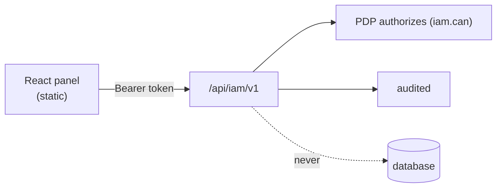

# Admin panel

A React + Vite + Tailwind console that drives the server **only** through the [Admin API](/reference/admin-api).
It never reads the database directly — it is just another API client, so every action it performs is
PDP-authorized, idempotent on writes, and audited.

## Why API-only

::: callout tip "No privileged back door" icon:shield
Because the panel goes through the same `/api/iam/v1` surface as your automation, there is **no** path that
skips `iam.can`, idempotency or the audit chain. A human in the UI and a script hitting the API are governed
identically. This is [ADR-8](/architecture/decisions).
:::

## What you can do

::: grids
  ::: grid
    ::: card "Applications & manifests" icon:boxes
    Register apps, review manifest **diffs**, approve / apply / rollback.
    :::
  :::
  ::: grid
    ::: card "Roles, permissions & policy" icon:scale
    Browse roles and permissions; test decisions live in the **policy playground**.
    :::
  :::
  ::: grid
    ::: card "Governance" icon:clipboard-check
    Run access-review campaigns, triage access requests, inspect anomalies.
    :::
  :::
  ::: grid
    ::: card "Audit, users & sessions" icon:link
    Inspect the hash-chained audit trail; manage users, sessions & tokens, events & webhooks.
    :::
  :::
:::

The policy playground is especially useful: it calls `/decisions/explain` so you can see *why* a subject is
allowed or denied a permission, with the matched policies and failed conditions, before you ship a manifest
change.

## Deployment

The panel is a static front-end deployed alongside the server. Put it behind the same TLS and auth boundary;
it authenticates as an admin caller and holds no database credentials. See
[Deployment](/operations/deployment).

::: callout warning "The panel needs an admin token, scoped by permission" icon:key-round
Panel users authenticate and are authorized **per action** by the PDP (`iam.can:iam:<permission>`). Grant
panel operators only the `iam:*` permissions their role needs — the panel cannot do anything its token isn't
authorized for.
:::

## Next

- [Admin API reference](/reference/admin-api) — what the panel calls.
- [Securing the Admin API](/best-practices/securing-admin-api) — the hardening the panel inherits.
- [Ask the PDP](/guides/ask-the-pdp) — the decisions the policy playground explains.
