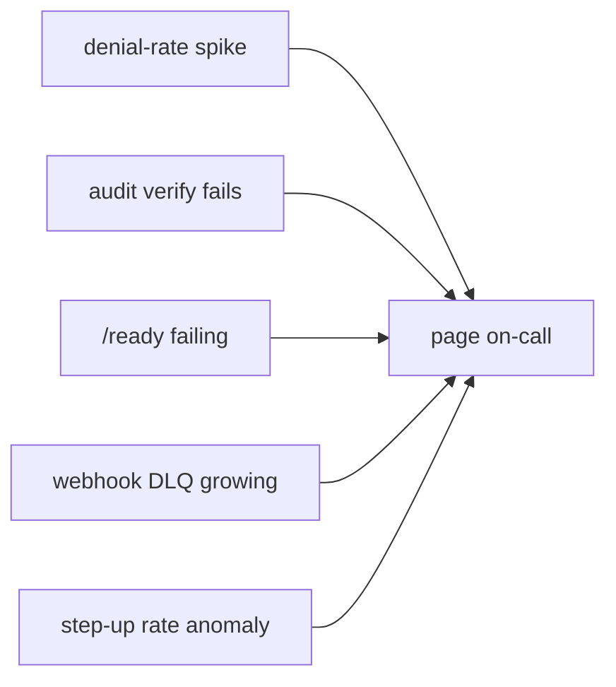

# Observability

An IAM control plane fails *closed*, so an outage shows up as a spike in denials rather than errors — which
makes observability essential. Code lives in `src/Observability/` and `src/Http/HealthController`.

## Health & readiness

Two unauthenticated endpoints at the Admin API prefix:

```bash
GET /api/iam/v1/health   # liveness — the process is up
GET /api/iam/v1/ready    # readiness — DB and dependencies reachable
```

`Observability/HealthCheck` backs `/ready`. Wire `/health` to your liveness probe and `/ready` to your
readiness probe so traffic only arrives once the server can actually serve decisions.

## Tracing

The server emits traces through a pluggable `Tracer` interface. Pick one with `IAM_TRACER`:

| `IAM_TRACER` | Implementation | Use |
|---|---|---|
| `null` *(default)* | `NullTracer` | no overhead |
| `log` | `LogTracer` | writes spans to the Laravel log (a collector/Filebeat ships them on) |
| `otlp` | `OtlpTracer` | **native OTLP/HTTP push** straight to an OpenTelemetry collector |
| `stack` | `StackTracer` | **both** — local log **and** OTLP push |

::: callout tip "Native OTLP — no SDK, no gRPC, no hot-path latency" icon:radar
`otlp`/`stack` export spans to `POST {IAM_OTEL_ENDPOINT}/v1/traces` as OTLP/HTTP **JSON** — no heavy
OpenTelemetry SDK and no gRPC required. Spans are buffered during the request and flushed as one batch on
`terminating`, so tracing never adds a round-trip to a PDP decision. Export is best-effort: a down collector
never affects the app. Point `IAM_OTEL_ENDPOINT` at the collector's HTTP receiver (port **4318**):
```dotenv
IAM_TRACER=otlp                 # or `stack` to also keep local logs
IAM_OTEL_ENDPOINT=http://otel-collector.observability.svc.cluster.local:4318
IAM_OTEL_SERVICE_NAME=laravel-iam-console   # optional, defaults to app.name
IAM_OTEL_TIMEOUT=5
```
gRPC (4317) isn't supported directly — use the collector's HTTP endpoint, or a sidecar. And the endpoint must
be reachable from where the app runs (a `*.svc.cluster.local` address only resolves inside the cluster).
:::

You can also bind your own `Tracer` to forward to any APM. Tracing the PDP decision path is especially useful
for latency and for explaining slow decisions.

## Metrics endpoints

Read-only, tenant-scoped, **bounded** aggregations (M17) for dashboards:

```bash
GET /api/iam/v1/metrics/decisions   # allow/deny counts, step-up rate
GET /api/iam/v1/metrics/grants      # grant counts and changes
GET /api/iam/v1/metrics/audit       # audit volume / verification status
```

These power the panel's posture views and are safe to scrape on an interval.

## What to alert on



| Signal | Why it matters |
|---|---|
| **Denial-rate spike** | Fail-closed outage looks like mass denial, not 500s — this is your outage alarm |
| **`iam:audit:verify` non-zero** | The chain broke → potential tampering, a security incident |
| **`/ready` failing** | The server can't make decisions; pull it from rotation |
| **Webhook DLQ growth** | Subscribers down or rejecting; events backing up |
| **Anomaly signals** | The governance anomaly detector flagged unusual access |

::: callout tip "Denials are your health signal" icon:activity
Because the engine fails closed, "everything denied" is the *safe* failure — but you still need to notice it.
Alert on denial-rate anomalies so a dependency outage pages you instead of silently blocking users.
:::

## Next

- [Deployment](/operations/deployment) — wiring probes and schedules.
- [Audit & compliance](/best-practices/audit-and-compliance) — scheduled verification.
- [Configuration](/operations/configuration#observability) — tracer settings.
