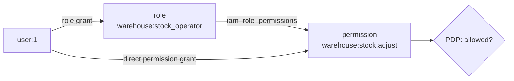

# Step 03 · First users, roles & permissions

**Goal:** create the *who* (users) and understand the *what* (permissions and roles) that you will assign in
step 05. By the end you'll know the shape of the authorization catalog and the two ways access reaches a
user: a **direct permission grant** and a **role grant**.

::: callout info "Where you are" icon:map-pin
Step 3 of 8. Server installed and configured. Now we populate the vocabulary of access.
:::

## 1. Create your first users

In IAM, a **subject** is *who is acting* — referenced everywhere as a `type:id` pair, e.g. `user:1`. For a
user subject, the `id` is your Laravel user's primary key. So the first thing we need is a user or two.

Create them in tinker (the demo does exactly this in its seeder):

```bash
php artisan tinker
```
```php
>>> use App\Models\User;
>>> User::factory()->create(['name' => 'Alice', 'email' => 'alice@example.com']);
>>> User::factory()->create(['name' => 'Bob',   'email' => 'bob@example.com']);
>>> User::pluck('name', 'id');
=> [ 1 => "Alice", 2 => "Bob" ]
```

Remember those ids: **Alice is `user:1`, Bob is `user:2`**. We'll grant Alice access and prove Bob is denied.

::: callout tip "Prefer a seeder for repeatability" icon:sprout
For a checked-in fixture, put the same calls in `database/seeders/DatabaseSeeder.php` and run
`php artisan db:seed`. The demo app does this so its tests always start from a known user.
:::

## 2. The authorization catalog — permissions & roles

The server **hardcodes no permissions**. Every permission and role lives in a catalog (created by the
`create_iam_authz_catalog` migration) and is modelled by two Eloquent classes you'll see throughout:

| Concept | Model | Key fields |
|---|---|---|
| **Permission** | `Padosoft\Iam\Domain\Authorization\Models\Permission` | `app_key`, `key`, `full_key` (= `app_key:key`), `risk`, `deprecated_at`, `requires_step_up` |
| **Role** | `Padosoft\Iam\Domain\Authorization\Models\Role` | `app_key`, `key`, `full_key`, `label`, `self_requestable` |
| **Role → permissions** | pivot `iam_role_permissions` | `role_id`, `permission_id` |

A **permission** is an immutable slug like `warehouse:stock.adjust` (`full_key` = `app_key:key`). A **role**
bundles permissions through the `iam_role_permissions` pivot.

::: callout info "The recommended way to fill the catalog is a manifest" icon:boxes
You normally do **not** create permissions and roles by hand — you declare them in an **application
manifest** and apply it (that's [step 04](/tutorial/04-register-app), and it's governed: validated, diffed,
rollback-able). This section shows the catalog's shape so the manifest makes sense; the manual creation
below is how the package's own tests build fixtures.
:::

## 3. Populate the catalog directly (the manual way)

To *see* the catalog concretely, create one role that carries one permission — the same code the server's
feature tests use. We use a throwaway `demo` namespace here so it doesn't clash with the **`warehouse`** app
you'll register properly (via a manifest) in the next step:

```bash
php artisan tinker
```
```php
>>> use Padosoft\Iam\Domain\Authorization\Models\Permission;
>>> use Padosoft\Iam\Domain\Authorization\Models\Role;

>>> $perm = Permission::query()->create([
...     'app_key'  => 'demo',
...     'key'      => 'ping.run',
...     'full_key' => 'demo:ping.run',
... ]);

>>> $role = Role::query()->create([
...     'app_key'  => 'demo',
...     'key'      => 'pinger',
...     'full_key' => 'demo:pinger',
... ]);

>>> $role->permissions()->attach($perm->id);   // writes the iam_role_permissions pivot
>>> $role->permissions()->count();
=> 1
```

::: callout success "✅ Checkpoint" icon:check
`$role->permissions()->count()` returns `1`. You now have a role `demo:pinger` that resolves to the
permission `demo:ping.run`. In [step 04](/tutorial/04-register-app) you'll create a real app's catalog the
**governed** way (a manifest) — same shape, but validated, diffed and rollback-able.
:::

## 4. Two ways access reaches a user

This is the mental model for the next step. A user is authorized for a permission when they hold a **grant**
that resolves to it. There are two kinds:

::: grids
  ::: grid
    ::: card "Direct permission grant" icon:key
    Grant the **permission** straight to the subject:
    `user:1` → permission `warehouse:stock.adjust`. Precise, one permission at a time. Good for exceptions.
    :::
  :::
  ::: grid
    ::: card "Role grant" icon:users
    Grant a **role** to the subject: `user:1` → role `warehouse:stock_operator`. The PDP expands the role to
    all its permissions (through the pivot). Good for the common case — assign a job, not a checklist.
    :::
  :::
:::



Both are stored as rows in the **`iam_grants`** table via the `Grant` model — the subject of
[step 05](/tutorial/05-assign-roles), where you'll actually create them and watch the PDP react.

::: callout warning "A catalog entry is not access" icon:alert-triangle
Creating a permission or role **grants nothing**. It only *defines* what could be granted. Until a subject
holds a matching `Grant`, the PDP denies — that's the fail-closed default. Assignment happens in step 05.
:::

## What you just did

::: steps
1. **Created** users — Alice (`user:1`) and Bob (`user:2`).
2. **Learned** the catalog: `Permission`, `Role`, and the `iam_role_permissions` pivot.
3. **Populated** it manually with one role carrying one permission.
4. **Understood** the two paths to access: a direct permission grant vs a role grant.
:::

**Next:** do it the governed way — register an application by applying a **manifest**.

**[→ Step 04 · Register an application](/tutorial/04-register-app)**

---

Deeper references: [Core concepts](/core-concepts) · [Authorization models](/concepts/authorization-models) ·
[Database schema](/reference/database-schema)
