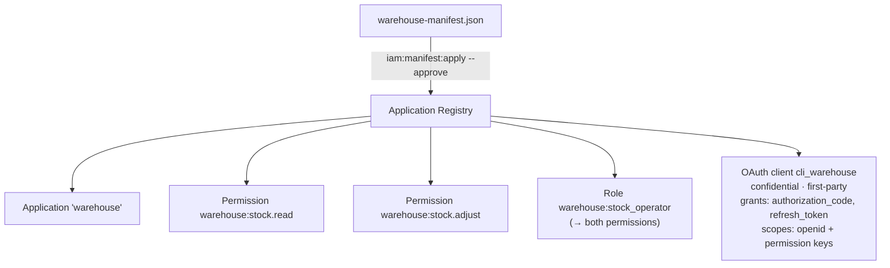

# Step 04 · Register an application

**Goal:** register your first real application — **`warehouse`** — by writing a **manifest** and applying it.
This is the governed, production way to fill the authorization catalog: the manifest is validated and diffed
before anything changes, and it can be rolled back.

::: callout info "Where you are" icon:map-pin
Step 4 of 8. You understand the catalog's shape (step 03); now you create one the right way and get an
OAuth client for free.
:::

## Why a manifest?

If the server shipped a fixed permission list, every new app would need a core release. Instead, each app
**declares** its permissions, roles, scopes and conditions as data — a *manifest* — and the **Application
Registry** turns that into governed policy: validate → diff → apply → (rollback if needed). Full theory in
[Register an application](/guides/register-application) and [Manifests](/concepts/manifests).

## 1. Write the manifest file

Create `warehouse-manifest.json` in your app root. Use this **exact shape** — it's the schema the server
validates and applies (`laravel-iam.manifest.v2`):

```json
{
  "schema": "laravel-iam.manifest.v2",
  "app": {
    "key": "warehouse",
    "name": "Warehouse",
    "type": "laravel",
    "risk_level": "low"
  },
  "auth": {
    "client_type": "confidential",
    "redirect_uris": ["http://localhost:8000/callback"]
  },
  "permissions": [
    { "key": "stock.read",   "risk": "low",    "resource": "stock", "action": "read" },
    { "key": "stock.adjust", "risk": "medium" }
  ],
  "roles": [
    { "key": "stock_operator", "label": "Stock Operator", "permissions": ["stock.read", "stock.adjust"] }
  ]
}
```

What each part means:

- **`app.key`** — the immutable app slug. Permission `full_key`s become `warehouse:<key>` (so
  `stock.read` → `warehouse:stock.read`).
- **`auth`** — asks the registry to create an OAuth client for the app. `confidential` = a server-side app
  that can keep a secret; `redirect_uris` is where the IdP sends users back after login (step 07).
- **`permissions`** — declared with **short** keys (`stock.read`); the registry namespaces them under the
  app. `risk`, `resource`, `action` are metadata used by governance.
- **`roles`** — bundle permissions by their short key.

::: callout warning "Slugs are forever" icon:lock
A permission slug is an immutable identity. Renaming means *adding* a new permission and migrating grants —
the diff shows a remove + add, not a rename. Plan your namespace before you ship it.
:::

## 2. Validate it first

Never apply blind — validate the file:

```bash
php artisan iam:manifest:validate warehouse-manifest.json
```

::: callout success "✅ Checkpoint — exit code 0" icon:check
A well-formed manifest exits **0** with no errors. To *see* validation working, temporarily break it (e.g.
change `"key": "warehouse"` to `"key": "Bad Key!"`) and re-run — it exits **1** and tells you `app.key` is
invalid. Fix it back to `warehouse` before continuing.
:::

## 3. Apply it

```bash
php artisan iam:manifest:apply warehouse-manifest.json --approve
```

Why `--approve`? Adding `redirect_uris` on a brand-new app is a **sensitive change** (it creates OAuth
capability), so the applier requires an explicit human approval gate. `--approve` is that gate. You can also
record who did it with `--by=your-name`.

::: callout success "✅ Checkpoint — the catalog and client exist" icon:check
```bash
php artisan tinker
```
```php
>>> use Padosoft\Iam\Domain\Applications\Models\Application;
>>> use Padosoft\Iam\Domain\Authorization\Models\Permission;
>>> use Padosoft\Iam\Domain\Authorization\Models\Role;
>>> use Padosoft\Iam\Domain\OAuth\Models\OauthClient;

>>> Application::where('key','warehouse')->exists();
=> true
>>> Permission::where('full_key','warehouse:stock.adjust')->exists();
=> true
>>> Role::where('full_key','warehouse:stock_operator')->first()->permissions()->count();
=> 2
>>> OauthClient::where('client_id','cli_warehouse')->value('redirect_uris');
=> ["http://localhost:8000/callback"]
```
:::

## What `apply` created for you



- An **`Application`** row keyed `warehouse`, pointing at this applied manifest version.
- The **permissions** `warehouse:stock.read` and `warehouse:stock.adjust` in the catalog.
- The **role** `warehouse:stock_operator` wired to both permissions.
- An **OAuth client** `cli_warehouse` (the registry owns it) — `confidential`, first-party, with the
  `authorization_code` + `refresh_token` grants and scopes = `openid` plus your permission keys. **You'll use
  this client in step 07 for login.**

::: callout info "Change it later, safely" icon:git-compare
Editing a permission or role later? Change the manifest and re-apply — the registry **diffs** it against the
applied version first (added/removed permissions, breaking changes). You can `iam:manifest:rollback warehouse`
to the previous version. Removing a permission soft-deprecates it (`deprecated_at`) rather than hard-deleting
grants.
:::

::: callout warning "If it fails" icon:alert-triangle
- **`iam:manifest:apply` reports a sensitive change and refuses** → you omitted `--approve`. Re-run with it.
- **Validation errors about `app.key` / `app.type`** → check the slug is lowercase and the `schema` line is
  exactly `laravel-iam.manifest.v2`.
- **`Class ... Application not found`** → make sure you `use` the fully-qualified model names shown above.

More in [Troubleshooting](/tutorial/troubleshooting).
:::

## What you just did

::: steps
1. **Wrote** a real `laravel-iam.manifest.v2` manifest for the `warehouse` app.
2. **Validated** it (exit 0), and saw a malformed one rejected (exit 1).
3. **Applied** it with `--approve`, creating the catalog + an OAuth client atomically.
4. **Verified** the `Application`, permissions, role and `cli_warehouse` client all exist.
:::

**Next:** assign this access to Alice with `Grant`, and watch the PDP allow her and deny Bob.

**[→ Step 05 · Assign access with Grants](/tutorial/05-assign-roles)**

---

Deeper references: [Register an application](/guides/register-application) ·
[Manifests & declared policy](/concepts/manifests) · [CLI reference](/operations/cli) ·
[Admin API](/reference/admin-api)
