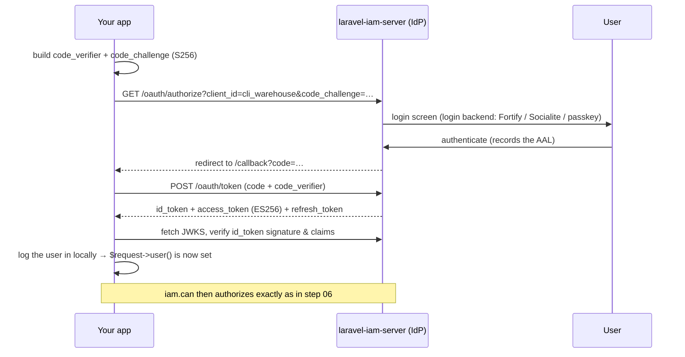

# Step 07 · OIDC / OAuth login

**Goal:** replace step 06's stand-in login with a **real** identity flow. The server is a full **OAuth2 /
OIDC identity provider** — this step shows its endpoints working, walks the login flow against the
`cli_warehouse` client you created in step 04, and is precise about which piece does what.

::: callout info "Where you are" icon:map-pin
Step 7 of 8. Authorization already works (steps 05–06). This step is about *authentication* — how a user
proves who they are so that `$request->user()` (which `iam.can` needs) is a real, IdP-issued identity.
:::

::: callout warning "Read this first — the division of labour" icon:split
`laravel-iam-client` decides **authorization** (it calls the PDP). It does **not** perform the OIDC login
handshake. Login is the **server's** job as an IdP, plus a **login backend** for the actual username/password
(or passkey) screen, plus your app performing the standard OIDC flow (e.g. via Laravel Socialite or any OIDC
client library) pointed at the server's discovery document. This step shows the real endpoints and flow; a
fully interactive click-through needs the extra setup called out below.
:::

## 1. See the IdP endpoints (these work now)

The server publishes standard OIDC metadata at the application root. With `php artisan serve` running:

```bash
curl http://localhost:8000/.well-known/openid-configuration
```

::: callout success "✅ Checkpoint — discovery responds" icon:check
You get a JSON document advertising the `issuer` (the value you set in step 02) and the
`authorization_endpoint`, `token_endpoint`, `jwks_uri` and `userinfo_endpoint`. Any OIDC-compliant client can
read this to configure itself — no bespoke wiring.
:::

The public signing keys live at the JWKS endpoint:

```bash
curl http://localhost:8000/.well-known/jwks.json
```

::: callout info "JWKS is empty until the first token is signed" icon:info
Signing keys are created lazily on first use (step 02). If `keys` is empty, the server simply hasn't signed
anything yet — issue one token through the flow below and the EC P-256 verification key appears here, with a
`kid`, `"kty":"EC"`, `"crv":"P-256"`, `"alg":"ES256"`.
:::

## 2. The login flow, against your `cli_warehouse` client

Your step-04 manifest created an OAuth client `cli_warehouse` (confidential, grants `authorization_code` +
`refresh_token`, redirect `http://localhost:8000/callback`). Here is the authorization-code + PKCE flow it
enables:



The endpoints are all real and mounted (verify with `php artisan route:list --path=oauth`):

| Step | Endpoint |
|---|---|
| Authorize (interactive) | `GET /oauth/authorize` |
| Exchange the code | `POST /oauth/token` |
| Verify tokens | `GET /.well-known/jwks.json` |
| User claims | `GET /oidc/userinfo` |

## 3. Add a login backend so `/oauth/authorize` can authenticate

`/oauth/authorize` needs a way to actually log the user in. The server treats the login backend as
pluggable — install one (they are `suggest` dependencies, not bundled):

::: tabs
== tab "Fortify (username / password)"
```bash
composer require laravel/fortify
```
A native username/password backend for the authorize screen.
== tab "Socialite (federated)"
```bash
composer require laravel/socialite
```
Federated / social login; the IdP records which upstream provider proved the identity.
== tab "Passkeys (WebAuthn)"
```bash
composer require laravel/passkeys
```
WebAuthn / passkeys — satisfies **AAL2** for [step-up](/concepts/assurance-aal).
:::

With a backend installed and your users seeded (step 03), a visit to `/oauth/authorize?...` presents a real
login screen and, on success, redirects back to your `redirect_uri` with a `code`.

## 4. Wire the flow in the consuming app

Because the client package does not do the handshake, your app performs the standard OIDC flow. Two common
routes:

- **Laravel Socialite** with a generic OIDC/OAuth2 provider pointed at
  `http://localhost:8000/.well-known/openid-configuration`, `client_id=cli_warehouse` and your client secret.
- **Any OIDC client library** that consumes the discovery document.

On callback, exchange the code at `/oauth/token`, verify the `id_token` against JWKS, then call Laravel's
`Auth::login($user)` for the matched user. From that point on, **step 06 is unchanged** — `iam.auth` sees a
real user and `iam.can` authorizes them against their grants.

::: callout warning "Always verify the id_token" icon:shield
Verify the `id_token` signature against JWKS and check `iss`, `aud` and `exp` before trusting any claim. The
non-PHP SDKs ([Node](https://doc.laravel-iam-node.padosoft.com),
[Rust](https://doc.laravel-iam-rust.padosoft.com)) do this fail-closed; if you hand-roll it, do the same.
:::

::: callout info "Honest scope of this step" icon:info
What you can run immediately: the discovery and JWKS endpoints, and `route:list --path=oauth`. The fully
interactive login click-through additionally requires a login backend (above) **and** an OIDC integration in
your app. That is deliberately outside a copy-paste tutorial, but every endpoint it uses is real and
documented in [OIDC login](/guides/oidc-login) and [OAuth2 clients & PKCE](/guides/oauth-clients).
:::

::: callout warning "If it fails" icon:alert-triangle
- **Discovery 404** → the server isn't serving, or the OIDC routes were disabled. Run
  `php artisan route:list --path=well-known`; start `php artisan serve`.
- **JWKS `keys` is empty** → normal before the first token; issue one via the flow and re-check.
- **`invalid_client` at `/oauth/token`** → the `client_id` must be `cli_warehouse` and the `redirect_uri`
  must exactly match the one in your manifest.
- **Login screen never appears** → no login backend installed (section 3).

More in [Troubleshooting](/tutorial/troubleshooting).
:::

## What you just did

::: steps
1. **Confirmed** the IdP is live — discovery + JWKS endpoints respond.
2. **Understood** the authorization-code + PKCE flow against your `cli_warehouse` client.
3. **Learned** how to add a login backend (Fortify / Socialite / passkeys).
4. **Saw** where login ends and authorization (steps 05–06) begins — the clean IdP ↔ PDP split.
:::

**Next:** a final checklist to confirm the whole thing is healthy, plus where to go from here.

**[→ Step 08 · Verify everything works](/tutorial/08-verify-and-next)**

---

Deeper references: [OIDC login](/guides/oidc-login) · [OAuth2 clients & PKCE](/guides/oauth-clients) ·
[OAuth2 & OIDC architecture](/architecture/oauth-oidc) · [Assurance levels](/concepts/assurance-aal)
