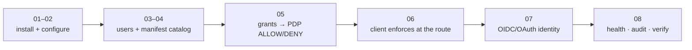

# Step 08 · Verify everything works

**Goal:** confirm the whole thing is healthy with a short checklist you can re-run any time, then point you at
the deep guides and the production topology.

::: callout info "Where you are" icon:map-pin
Step 8 of 8. The finish line — a green checklist that proves the control plane is up, deciding, and auditable.
:::

## The final checklist

::: steps
1. **The schema is migrated**
   ```bash
   php artisan tinker --execute="echo Schema::hasTable('iam_grants') ? 'iam_grants ✅' : 'MISSING ❌';"
   ```
   Expect `iam_grants ✅`.
2. **The commands are registered**
   ```bash
   php artisan list iam
   ```
   Expect the `iam:*` family (manifests, audit, reviews, least-privilege…).
3. **Health & readiness respond** (unauthenticated, with `php artisan serve` running)
   ```bash
   curl http://localhost:8000/api/iam/v1/health
   curl http://localhost:8000/api/iam/v1/ready
   ```
   Expect an OK / ready response — no auth needed on these two.
4. **The audit chain is intact**
   ```bash
   php artisan iam:audit:verify
   ```
   Every mutation you made (manifest apply, grants) was hash-chained; this walks the chain and reports any
   break. Expect a clean verification.
5. **The IdP is live**
   ```bash
   curl http://localhost:8000/.well-known/openid-configuration
   ```
   Expect the discovery JSON with your issuer.
6. **The PDP still decides correctly**
   ```bash
   php artisan tinker
   ```
   ```php
   >>> $pdp = app(\Padosoft\Iam\Contracts\Authorization\AuthorizationEngine::class);
   >>> $pdp->check(['subject'=>['type'=>'user','id'=>'1'],'permission'=>'warehouse:stock.adjust'])['allowed'];
   => true    // Alice
   >>> $pdp->check(['subject'=>['type'=>'user','id'=>'2'],'permission'=>'warehouse:stock.adjust'])['allowed'];
   => false   // Bob (unless you granted him in step 06)
   ```
:::

::: callout success "✅ You have a working, tested IAM" icon:party-popper
If those six checks pass, you have a self-hosted Identity & Authorization control plane: installed, migrated,
configured, populated via a governed manifest, assigned with grants, enforced at a route, and auditable —
end to end, on your own machine.
:::

## Optional — a live introspection page

Want the whole picture on one screen (installed packages, `iam:*` commands, migrated `iam_*` tables, and live
ALLOW/DENY like the official [demo](https://github.com/padosoft/laravel-iam-demo))? The demo ships a
controller that renders exactly this at `/iam`. Its source is a great template — it lists commands with
`collect(Artisan::all())->keys()->filter(fn ($n) => str_starts_with($n, 'iam:'))` and runs real
`AuthorizationEngine::check()` scenarios. Copy its `IamDemoController` if you want a dashboard.

## What you built



## Go to production — split server and client

This tutorial ran server and client in **one** app for learning. For real deployments:

::: grids
  ::: grid
    ::: card "Run the server standalone" icon:server
    Host `laravel-iam-server` as your IdP/PDP. Set explicit secrets (`IAM_OAUTH_ENCRYPTION_KEY`,
    `IAM_ADMIN_AUDIENCE`), a real issuer, and back crypto with a KMS. See
    [Deployment](/operations/deployment) and [Configuration](/operations/configuration).
    :::
  :::
  ::: grid
    ::: card "Install only the client in each app" icon:plug
    In every consuming app install `laravel-iam-client` in **`http`** mode
    (`IAM_CLIENT_MODE=http`, `IAM_CLIENT_BASE_URL=https://iam.example.com/api/iam/v1`). The `iam.can` /
    `iam.auth` aliases work directly there (no server in the app, so no alias collision).
    :::
  :::
  ::: grid
    ::: card "Harden the Admin API" icon:shield
    Pin the token audience, keep idempotency on writes, and rate-limit. See
    [Securing the Admin API](/best-practices/securing-admin-api).
    :::
  :::
  ::: grid
    ::: card "Operate it" icon:activity
    Schedule `iam:audit:verify`, `iam:audit:checkpoint` and `iam:least-privilege:scan`; wire observability.
    See [CLI reference](/operations/cli) and [Observability](/operations/observability).
    :::
  :::
:::

## Where to go next

- **[Core concepts](/core-concepts)** — the mental model, if you skipped the theory.
- **[Authorization models](/concepts/authorization-models)** — RBAC + ABAC + ReBAC, formally.
- **[ReBAC relationships](/guides/rebac-relationships)** — per-resource, relationship-based access.
- **[Access reviews](/guides/access-reviews)** & **[Access requests](/guides/access-requests)** — the
  governance suite.
- **[Admin API reference](/reference/admin-api)** — the full HTTP surface behind everything you did.

::: callout tip "Re-run this checklist any time" icon:refresh-cw
These six checks are your smoke test. Run them after upgrades or config changes to confirm the control plane
is still healthy.
:::

Congratulations — you went from zero to a working, tested IAM. 🎉
