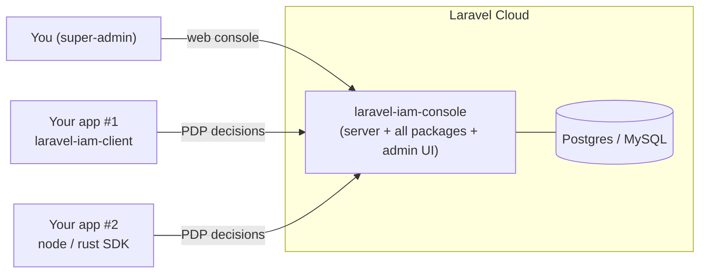

# Step 09 · Deploy your own server on Laravel Cloud

**Goal:** turn everything you did locally (steps 01–08) into a **hosted IAM server** your real apps can use.
`laravel-iam-server` is a *package*, not an app — so you deploy a **host application** that installs it. The
fastest path is the ready-made **[`laravel-iam-console`](https://github.com/padosoft/laravel-iam-console)**:
one Laravel 13 app that installs the whole ecosystem **and** ships a web admin console.

::: callout info "Where you are" icon:map-pin
Step 9 of 9. Local IAM works end to end. Now you host it — with a UI to run it — and point apps at it.
:::

## What you deploy

::: callout tip "A package can't be deployed — a host app can" icon:package
`composer require padosoft/laravel-iam-server` adds IAM *into* a Laravel app. `laravel-iam-console` **is** that
app, pre-wired: all packages + [Fortify](https://laravel.com/docs/fortify) login + a **super-admin seeder** +
a **React admin console** (users, roles &amp; grants, sessions, audit, access reviews, AI recommendations,
apps). You can also roll your own host app the same way — the console just saves you the wiring.
:::



## Minimum infrastructure

Just **an app + a database**. **No Redis, no object storage**: sessions/cache/queue run on the database, and
ES256 signing keys are generated and stored locally (`IAM_KMS_DRIVER=local`). Add Redis/KMS only at scale.

## Deploy, step by step

::: steps

1. **Get the app on GitHub**
   Fork or clone [`padosoft/laravel-iam-console`](https://github.com/padosoft/laravel-iam-console) into your
   own repository.

2. **Create a Laravel Cloud project** and connect that repository.

3. **Add a database** (Postgres or MySQL) in the project. Laravel Cloud injects the `DB_*` environment.

4. **Set environment variables** (Project → Environment):
   ```dotenv
   APP_URL=https://your-iam.example.com
   IAM_ISSUER=https://your-iam.example.com
   IAM_KMS_DRIVER=local
   SESSION_DRIVER=database
   CACHE_STORE=database
   QUEUE_CONNECTION=database
   IAM_SUPERADMIN_EMAIL=you@example.com
   IAM_SUPERADMIN_PASSWORD=a-strong-password
   ```

5. **Set the deploy/build command** — build the console UI and run migrations + the super-admin seeder:
   ```bash
   composer install --no-dev --optimize-autoloader
   npm --prefix resources/console ci && npm --prefix resources/console run build
   php artisan migrate --force
   php artisan db:seed --class=SuperAdminSeeder --force
   ```

6. **Enable the scheduler** (a Laravel Cloud toggle). It drives the only async work — audit checkpoints,
   webhook delivery, access-review reminders — and needs no Redis.

7. **Deploy, then sign in.** Open `https://your-iam.example.com`, log in as the super-admin, and you have a
   running control plane with a UI. The super-admin holds every `iam:*` permission, so they can create users
   and grant scoped roles/permissions from the console.

:::

::: callout success "✅ You now run IAM as a service" icon:party-popper
A hosted server, a web console to manage it, and a super-admin to log in with — reachable by every app you own.
:::

## Point your first apps at it

Each **consuming app** installs the client and talks to your server — exactly like [step 06](/tutorial/06-connect-client),
but in `http` mode against the hosted URL:

```bash
composer require padosoft/laravel-iam-client
```
```dotenv
IAM_CLIENT_MODE=http
IAM_CLIENT_BASE_URL=https://your-iam.example.com/api/iam/v1
IAM_CLIENT_APP=your-app-key
```

Then protect routes with `iam.auth` / `iam.can` as before. Non-PHP apps use the
[Node](https://doc.laravel-iam-node.padosoft.com), [React Native](https://doc.laravel-iam-react-native.padosoft.com)
or [Rust](https://doc.laravel-iam-rust.padosoft.com) SDK against the same server.

## Roll your own host app (optional)

Prefer to build the host yourself? It's the tutorial you just did, packaged:

```bash
composer create-project laravel/laravel my-iam
cd my-iam
composer require padosoft/laravel-iam-server padosoft/laravel-iam-client laravel/fortify
# + optional modules: padosoft/laravel-iam-ai padosoft/laravel-iam-directory padosoft/laravel-iam-bridge-spatie-permission
php artisan migrate
```

Add a login backend (Fortify), a super-admin seeder (grant the first user the `iam:*` permissions — see
[step 05](/tutorial/05-assign-roles)), and deploy the same way. `laravel-iam-console` is exactly this, done
for you and with a UI on top.

::: callout warning "If it fails" icon:alert-triangle
- **Login works but the Admin API 403s** → the logged-in user isn't a super-admin. Run the seeder
  (`php artisan db:seed --class=SuperAdminSeeder --force`) or grant the `iam:*` permissions.
- **`Console UI not built`** → the deploy build command didn't run `npm ... run build`. Re-check step 5.
- **JWKS empty / issuer mismatch** → set `IAM_ISSUER` to your public `APP_URL`; keys generate on first token.
:::

## That's the whole journey

::: steps
1. **Installed** the server and all packages, configured and migrated.
2. **Created** users, a catalog, an app, and **assigned access** — with real PDP ALLOW/DENY.
3. **Connected a client** and saw enforcement at the edge, then the **OIDC** login split.
4. **Verified** health and audit, and now **hosted** the whole thing with a console on Laravel Cloud.
:::

**Deeper:** [laravel-iam-console](https://github.com/padosoft/laravel-iam-console) ·
[Deployment](/operations/deployment) · [Admin panel](/operations/admin-panel) ·
[Connect a client](/tutorial/06-connect-client)
