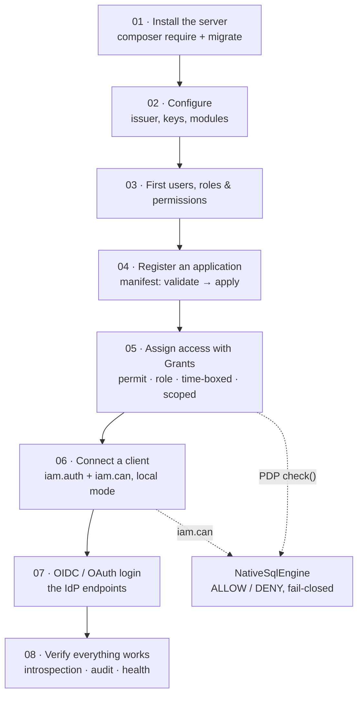

# Tutorial — from zero to a working, tested IAM

This is the **one continuous path** through Laravel IAM. Follow it top to bottom, in order, and you will go
from an empty machine to a **running server with real allow/deny decisions you can see and test** — no
hand-waving, every command copy-pasteable.

Every other page in these docs goes *deep* on one subsystem. This tutorial is the *thread* that sews them
together: at each step we do the minimum that actually works, then link you to the deep page when you want
the theory.

::: callout info "Who this is for" icon:compass
A developer who has **never seen this package before**. We explain every command and what you should see
after running it. If a step fails, each page ends with a "if it fails…" box. You do **not** need to know
OAuth, ABAC or ReBAC first — you will meet them one at a time.
:::

## What you will build

A single Laravel app that plays **both roles at once** — the IAM **server** (the identity & authorization
control plane) *and* a **consuming client** — exactly like the official
[demo app](https://github.com/padosoft/laravel-iam-demo). This is the fastest way to see the whole thing
work on one machine; the [last step](/tutorial/08-verify-and-next) shows how to split them into a real
server + separate client apps for production.

By the end you will have, and will have **verified**:

::: grids
  ::: grid
    ::: card "A booted control plane" icon:server
    Server + all packages installed, ~33 `iam_*` tables migrated, the `iam:*` commands registered.
    :::
  :::
  ::: grid
    ::: card "Users, roles & permissions" icon:users
    Your first users, a permission catalog and roles declared through an **application manifest**.
    :::
  :::
  ::: grid
    ::: card "Real grants" icon:key
    Access assigned with `Grant` — a direct permit, a role grant, a time-boxed grant, an app-scoped grant.
    :::
  :::
  ::: grid
    ::: card "A provable decision" icon:scale
    A live **ALLOW** and a live **DENY** from the PDP — in-process, through the client, and behind a
    protected route.
    :::
  :::
:::

## The whole flow at a glance



## Prerequisites

::: steps
1. **PHP 8.3 or newer**
   ```bash
   php -v
   ```
   You should see `PHP 8.3.x` (or 8.4 / 8.5). Laravel IAM requires **PHP 8.3+**.
2. **Composer**
   ```bash
   composer --version
   ```
3. **A database** — **SQLite is perfect for this tutorial** (zero setup: it's just a file). You can switch
   to MySQL or PostgreSQL later; every step below shows both where it matters.
4. **The Laravel installer or a way to create a Laravel 13 app** — we cover this in step 01, so a plain
   Composer install is enough.
:::

::: callout tip "SQLite vs a server database" icon:database
SQLite needs **nothing** installed — Laravel creates a `database/database.sqlite` file and you're done. Use
it for this walkthrough. Everything you learn transfers unchanged to MySQL/PostgreSQL; only the `.env`
connection lines differ, and we show them side by side.
:::

## How to read this tutorial

- Run the commands **in order** — later steps assume the state built by earlier ones.
- After most commands there is a **✅ "what you should see"** checkpoint. If your output differs, stop and
  compare before moving on.
- Text in `code font` is literal — type or paste it exactly.
- Every deep-dive link (**"go deeper →"**) is optional on a first pass; the tutorial stands alone.

## Start

::: grids
  ::: grid
    ::: card "Step 01 — Install the server" icon:download
    Create the app, `composer require` the server and modules, migrate, and confirm the tables and commands
    exist. **[Start →](/tutorial/01-install-server)**
    :::
  :::
:::

Stuck at any point? Jump to **[Troubleshooting](/tutorial/troubleshooting)** — it lists the mistakes a
first-timer actually hits (missing keys, wrong issuer, 401/403, un-migrated DB) with the exact fix.
