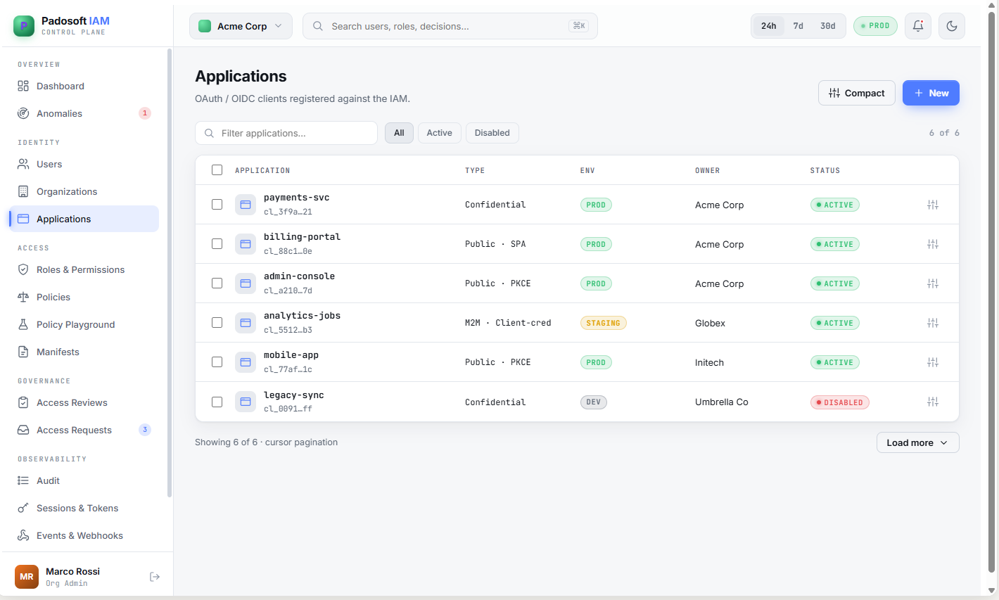
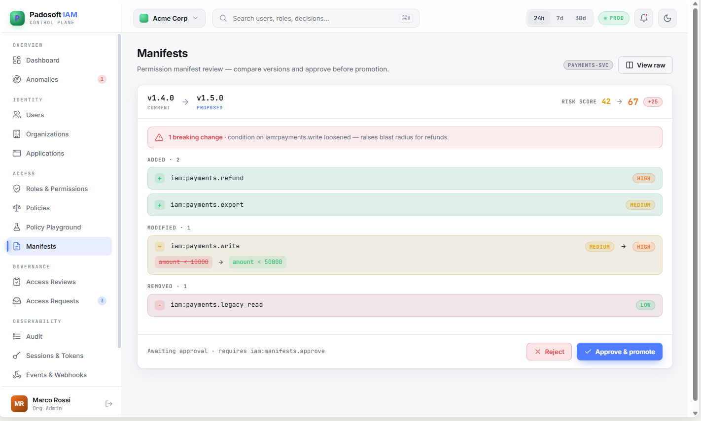
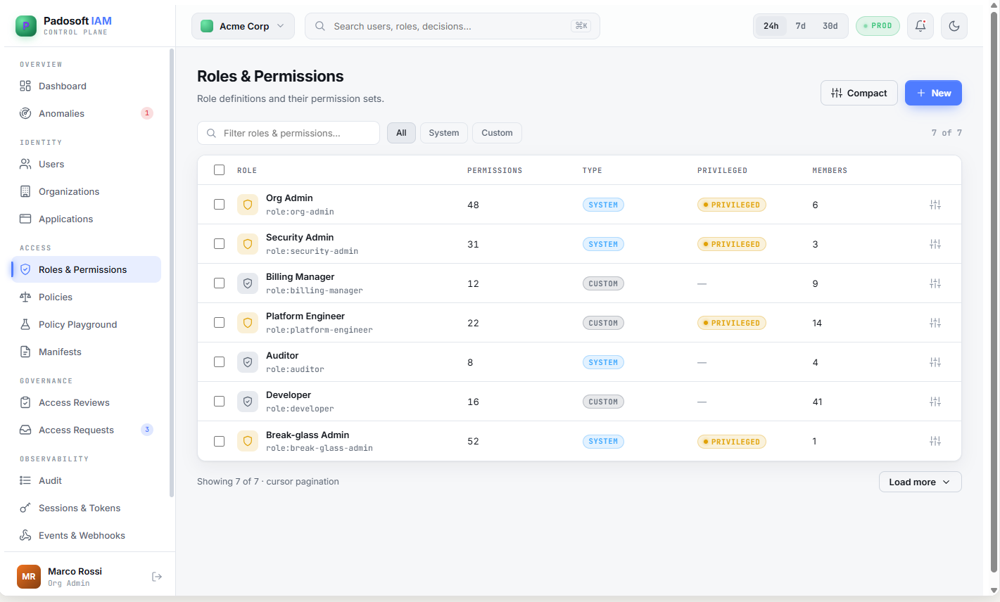
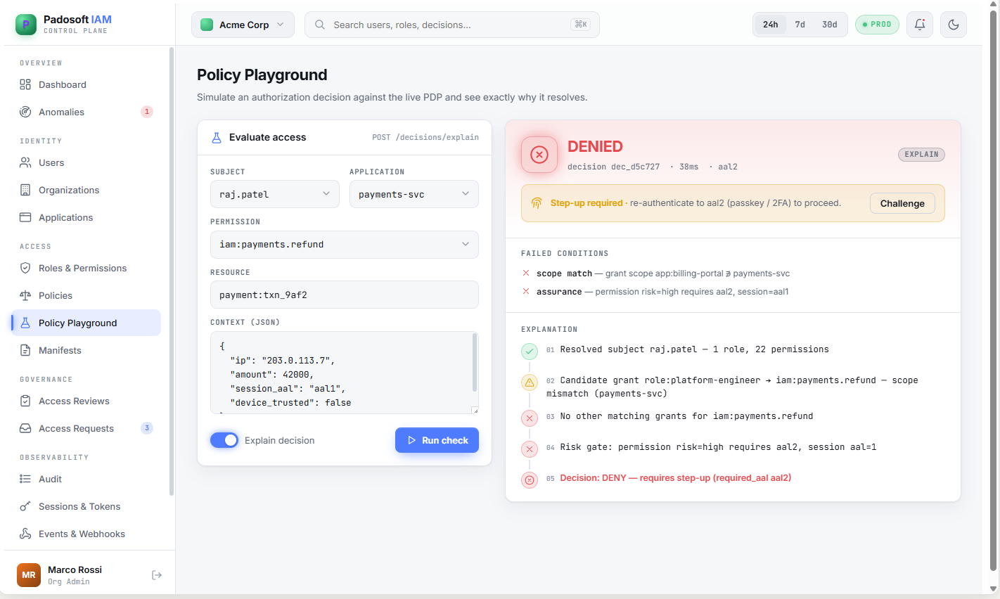
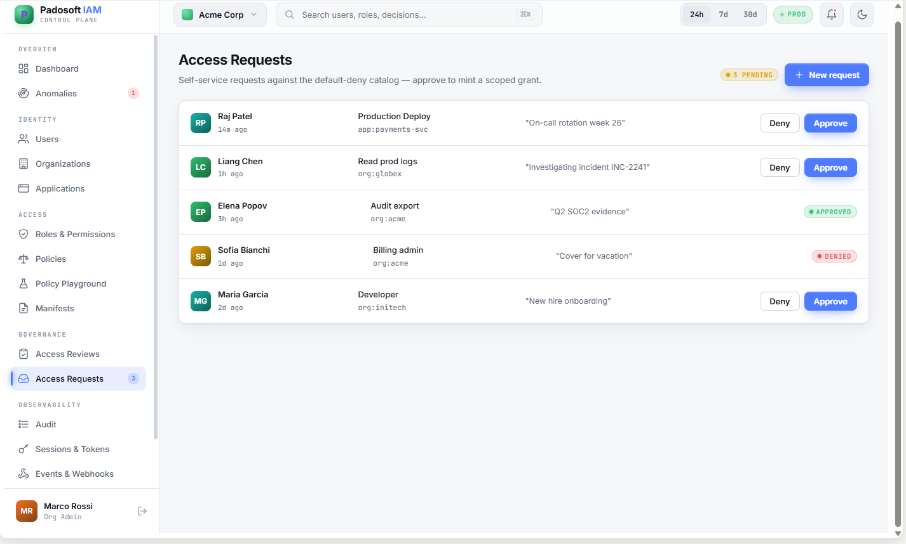
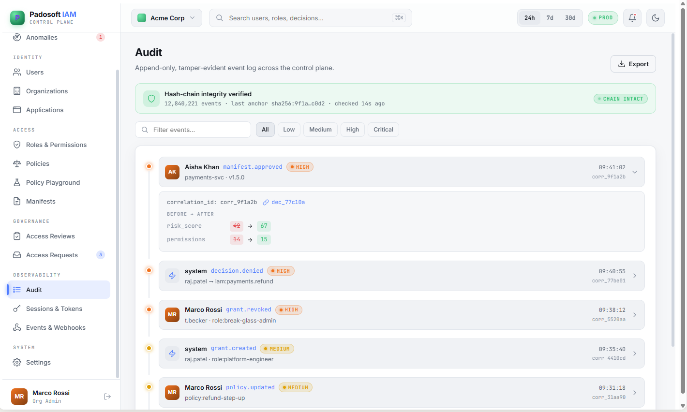
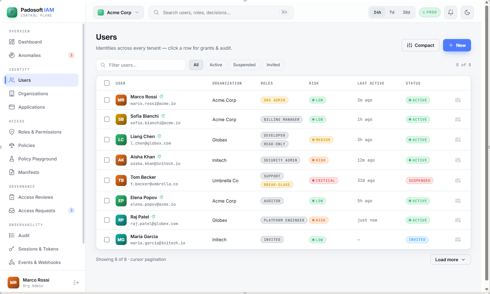
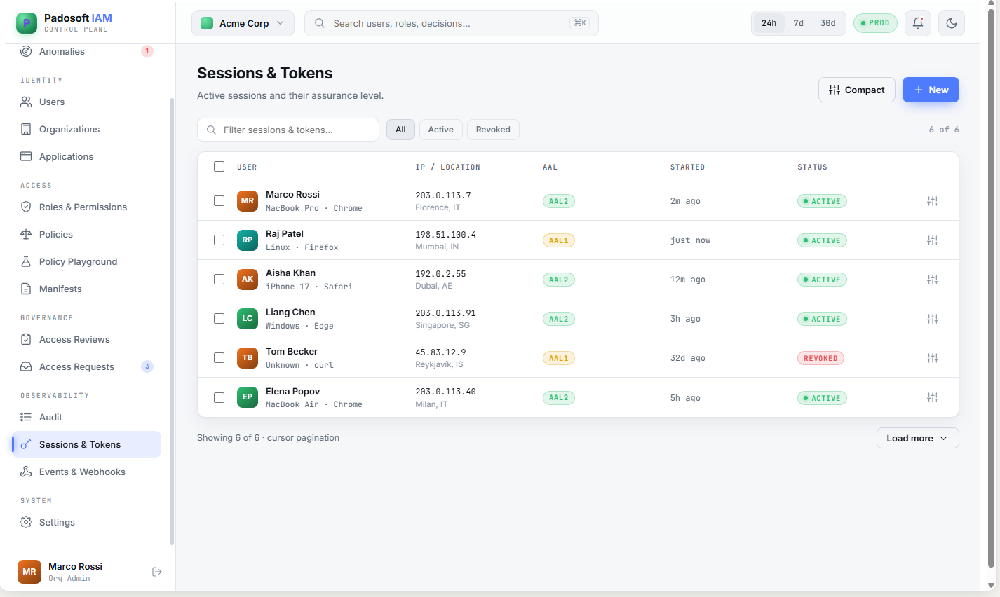
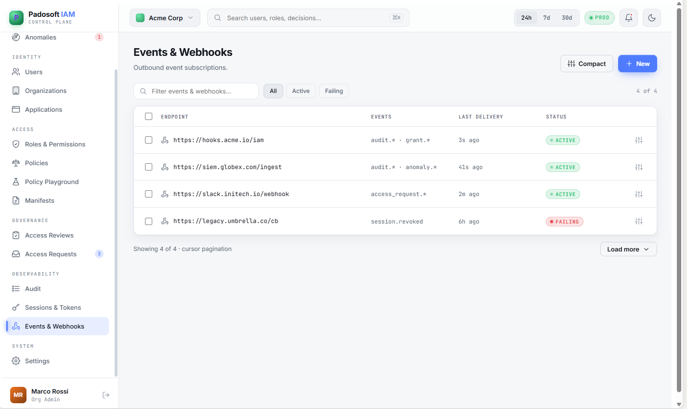

# Admin panel

A React + Vite + Tailwind console that drives the server **only** through the [Admin API](admin-api.md) — it
never reads the database directly.

## Screens

::: card "Applications & manifests"
Register apps, review manifest diffs, approve/apply/rollback.
:::

::: card "Roles, permissions & policy"
Browse roles and permissions; test decisions live in the policy playground.
:::

::: card "Governance"
Run access-review campaigns, triage access requests, review anomalies.
:::

::: card "Audit, users & sessions"
Inspect the hash-chained audit trail, users (overview, grants, organizations, audit), sessions & tokens,
events & webhooks.
:::

> All screenshots live in [`art/screenshots/`](https://github.com/padosoft/laravel-iam-server/tree/main/art/screenshots).

## Why API-only

Because the panel is just another Admin API client, every action it performs is authorized by the PDP,
idempotent on writes, and **audited** — there is no privileged back door that skips the same checks your
automation goes through.
